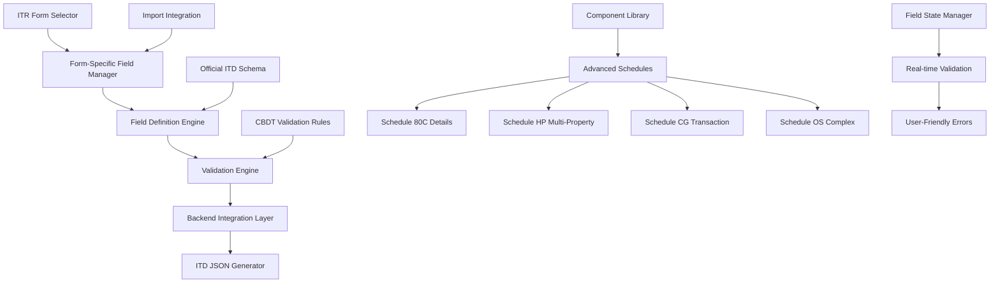
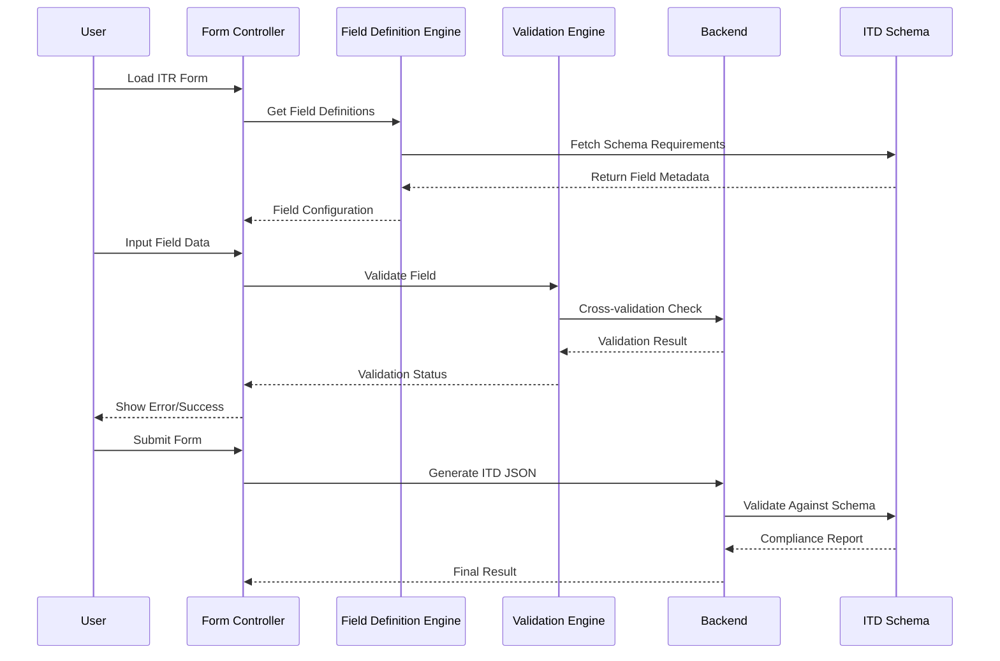
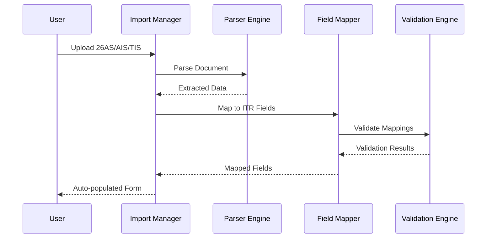

# Design Document: ITR Field Compliance Implementation

## Overview

Implement comprehensive CBDT-compliant ITR form fields and validation system for the Taxify frontend application to achieve 100% compliance with official ITD schemas for Assessment Year 2026-27. This involves implementing all missing mandatory fields, validation rules, and advanced schedules across ITR-1, ITR-2, ITR-3, and ITR-4 forms.

The current implementation has approximately 40% field coverage compared to official ITD schemas. This project will bridge the gap by implementing 500+ missing fields and 300+ validation rules as per CBDT specifications.

## Architecture



## Sequence Diagrams

### Main Form Loading and Validation Flow



### Import Integration Flow


## Components and Interfaces

### Component 1: Field Definition Engine

**Purpose**: Centralized management of all ITR field definitions with CBDT compliance metadata

**Interface**:
```typescript
interface FieldDefinitionEngine {
  getFieldsByForm(itrForm: ITRFormType): FieldDefinition[]
  getFieldValidation(fieldId: string): ValidationRule[]
  getMandatoryFields(itrForm: ITRFormType, context: FormContext): string[]
  getConditionalFields(fieldId: string, value: any): FieldDefinition[]
}

interface FieldDefinition {
  id: string
  name: string
  type: FieldType
  itrTag?: string // ITD XML tag mapping
  mandatory: boolean | MandatoryCondition
  validation: ValidationRule[]
  dependencies: FieldDependency[]
  schedule: ScheduleType
  section: string // Tax section reference
}

interface ValidationRule {
  type: 'required' | 'format' | 'range' | 'cross-field' | 'business-rule'
  rule: string
  message: string
  cbdtCode: string // CBDT rule reference
}
```

**Responsibilities**:
- Load field definitions from ITD schemas
- Provide form-specific field configurations
- Manage conditional field visibility
- Track mandatory field requirements per ITR form type

### Component 2: Advanced Validation Engine

**Purpose**: Implement comprehensive CBDT validation rules with real-time feedback

**Interface**:
```typescript
interface ValidationEngine {
  validateField(fieldId: string, value: any, context: FormContext): ValidationResult[]
  validateSchedule(schedule: ScheduleType, data: any): ValidationResult[]
  validateFormEligibility(itrForm: ITRFormType, data: any): EligibilityResult
  validateBusinessRules(data: any): ValidationResult[]
}

interface ValidationResult {
  field: string
  type: 'error' | 'warning' | 'info'
  message: string
  cbdtRule: string
  severity: 'critical' | 'moderate' | 'low'
}

interface EligibilityResult {
  eligible: boolean
  recommendedForm: ITRFormType
  reasons: string[]
  violations: ValidationResult[]
}
```

**Responsibilities**:
- Real-time field validation
- Cross-field dependency validation
- ITR form eligibility checks
- CBDT business rule enforcement

### Component 3: Schedule Management System

**Purpose**: Handle complex schedules like 80C details, multi-property HP, CG transactions

**Interface**:
```typescript
interface ScheduleManager {
  getScheduleFields(schedule: ScheduleType): FieldDefinition[]
  validateSchedule(schedule: ScheduleType, data: any): ValidationResult[]
  generateScheduleJson(schedule: ScheduleType, data: any): any
}

interface Schedule80CManager extends ScheduleManager {
  validateEPFContribution(amount: number, salary: number): ValidationResult[]
  validateLICPremium(premium: number, sumAssured: number): ValidationResult[]
  validateHomeLoanPrincipal(amount: number): ValidationResult[]
}

interface ScheduleHPManager extends ScheduleManager {
  validatePropertyCount(properties: Property[]): ValidationResult[]
  calculateNetRental(property: Property): number
  validateCoOwnership(property: Property): ValidationResult[]
}
```

**Responsibilities**:
- Manage complex schedule components
- Perform schedule-specific validations
- Generate ITD-compliant schedule JSON

### Component 4: Import Integration Manager

**Purpose**: Handle 26AS, AIS, TIS, and Prefill import with field mapping

**Interface**:
```typescript
interface ImportManager {
  parseDocument(file: File, type: DocumentType): Promise<ParsedData>
  mapToITRFields(data: ParsedData, itrForm: ITRFormType): FieldMapping[]
  validateImportedData(mappings: FieldMapping[]): ValidationResult[]
  autoPopulateForm(mappings: FieldMapping[]): FormData
}

interface FieldMapping {
  sourceField: string
  targetField: string
  value: any
  confidence: number
  requiresVerification: boolean
}
```

**Responsibilities**:
- Parse various import document formats
- Map external data to ITR fields
- Validate imported data consistency
- Auto-populate form with high-confidence mappings

## Data Models

### Model 1: ITR Form Configuration

```typescript
interface ITRFormConfig {
  formType: 'ITR-1' | 'ITR-2' | 'ITR-3' | 'ITR-4'
  version: string
  assessmentYear: string
  mandatorySchedules: ScheduleType[]
  eligibilityCriteria: EligibilityCriteria[]
  fieldGroups: FieldGroup[]
  validationProfile: ValidationProfile
}

interface EligibilityCriteria {
  condition: string
  description: string
  violationMessage: string
  recommendedForm?: ITRFormType
}

interface FieldGroup {
  id: string
  name: string
  schedule: ScheduleType
  fields: string[]
  dependencies: FieldDependency[]
}
```

**Validation Rules**:
- Form type must be valid ITR form
- Assessment year must match current AY
- All mandatory schedules must be present
- Field groups must have valid field references

### Model 2: Comprehensive Field Metadata

```typescript
interface FieldMetadata {
  id: string
  itrTag: string
  name: string
  description: string
  type: FieldType
  format: FieldFormat
  mandatory: MandatoryCondition
  validation: ValidationRule[]
  dependencies: FieldDependency[]
  schedule: ScheduleType
  section: TaxSection
  cbdtReference: string
}

interface MandatoryCondition {
  always: boolean
  conditions?: ConditionalRequirement[]
}

interface ConditionalRequirement {
  dependsOn: string
  operator: 'equals' | 'greater' | 'less' | 'exists'
  value: any
  description: string
}
```

**Validation Rules**:
- ITR tag must follow official ITD schema naming
- Mandatory conditions must be well-formed
- Dependencies must reference existing fields
- CBDT reference must be valid rule code

### Model 3: Schedule Structures

```typescript
interface Schedule80C {
  epfContribution: EPFDetails
  ppfInvestment: PPFDetails
  lifeInsurancePremium: LICDetails[]
  elssInvestment: ELSSDetails[]
  homeLoanPrincipal: HomeLoanDetails[]
  nscInterest: NSCDetails[]
  totalEligible: number
  totalClaimed: number
}

interface EPFDetails {
  employerContribution: number
  employeeContribution: number
  pensionFund: number
  totalContribution: number
  panOfEmployer: string
  employerName: string
}

interface Property {
  serialNumber: number
  address: AddressDetail
  ownership: OwnershipDetails
  lettingDetails: LettingDetails
  tenantDetails: TenantDetail[]
  incomeDetails: PropertyIncomeDetails
  coOwners?: CoOwner[]
}
```

**Validation Rules**:
- Sum of individual contributions cannot exceed schedule limits
- Property serial numbers must be sequential
- All mandatory address fields must be present
- PAN/Aadhaar format validation for parties

## Algorithmic Pseudocode

### Main Validation Algorithm

```pascal
ALGORITHM validateITRForm(formData, itrForm)
INPUT: formData of type FormData, itrForm of type ITRFormType
OUTPUT: validationResults of type ValidationResult[]

BEGIN
  ASSERT formData IS NOT NULL AND itrForm IS VALID
  
  validationResults ← EMPTY_LIST
  fieldDefinitions ← getFieldDefinitions(itrForm)
  
  // Step 1: Validate form eligibility
  eligibilityResult ← validateFormEligibility(itrForm, formData)
  IF NOT eligibilityResult.eligible THEN
    validationResults.ADD(createFormEligibilityError(eligibilityResult))
  END IF
  
  // Step 2: Validate mandatory fields with context
  FOR each field IN fieldDefinitions DO
    ASSERT field IS WELL_DEFINED AND field.validation IS NOT NULL
    
    IF isMandatory(field, formData) AND NOT hasValue(formData, field.id) THEN
      validationResults.ADD(createMandatoryFieldError(field))
    END IF
  END FOR
  
  // Step 3: Validate field values and formats
  FOR each field IN fieldDefinitions DO
    IF hasValue(formData, field.id) THEN
      fieldValidation ← validateFieldValue(field, getValue(formData, field.id), formData)
      validationResults.APPEND(fieldValidation)
    END IF
  END FOR
  
  // Step 4: Validate cross-field dependencies
  FOR each field IN fieldDefinitions DO
    IF field.dependencies IS NOT EMPTY THEN
      dependencyValidation ← validateDependencies(field, formData)
      validationResults.APPEND(dependencyValidation)
    END IF
  END FOR
  
  // Step 5: Validate business rules
  businessRuleValidation ← validateBusinessRules(formData, itrForm)
  validationResults.APPEND(businessRuleValidation)
  
  ASSERT ALL validationResults HAVE VALID ERROR MESSAGES
  RETURN validationResults
END
```

**Preconditions**:
- formData contains valid field values
- itrForm is a supported ITR form type
- Field definitions are loaded and available
- Validation rules are properly configured

**Postconditions**:
- Returns complete list of validation issues
- All critical errors are flagged for user attention
- Warning and info messages provide guidance
- Results include CBDT rule references for compliance tracking

**Loop Invariants**:
- All processed fields maintain validation result consistency
- Field definitions remain immutable during validation
- Validation context is preserved across iterations

### Field Dependency Resolution Algorithm

```pascal
ALGORITHM resolveDependencies(field, formData, visitedFields)
INPUT: field of type FieldDefinition, formData of type FormData, visitedFields of type Set
OUTPUT: isVisible of type boolean

BEGIN
  // Circular dependency detection
  IF field.id IN visitedFields THEN
    THROW CircularDependencyError(field.id)
  END IF
  
  visitedFields.ADD(field.id)
  
  // Base case: no dependencies
  IF field.dependencies IS EMPTY THEN
    RETURN true
  END IF
  
  // Evaluate all dependencies
  FOR each dependency IN field.dependencies DO
    dependentField ← getFieldDefinition(dependency.fieldId)
    
    // Recursive resolution
    dependentVisible ← resolveDependencies(dependentField, formData, visitedFields)
    
    IF NOT dependentVisible THEN
      RETURN false
    END IF
    
    // Evaluate dependency condition
    dependentValue ← getValue(formData, dependency.fieldId)
    conditionMet ← evaluateCondition(dependency.condition, dependentValue)
    
    IF NOT conditionMet THEN
      RETURN false
    END IF
  END FOR
  
  visitedFields.REMOVE(field.id)
  RETURN true
END
```

**Preconditions**:
- Field dependencies form a valid directed acyclic graph
- All referenced fields exist in field definitions
- Form data contains valid values for existing fields

**Postconditions**:
- Returns true if field should be visible/required
- Detects and prevents circular dependencies
- Maintains visited set integrity for recursion safety

### Import Data Mapping Algorithm

```pascal
ALGORITHM mapImportedData(parsedData, targetForm, confidenceThreshold)
INPUT: parsedData of type ParsedData, targetForm of type ITRFormType, confidenceThreshold of type number
OUTPUT: fieldMappings of type FieldMapping[]

BEGIN
  ASSERT parsedData IS VALID AND targetForm IS SUPPORTED
  
  fieldMappings ← EMPTY_LIST
  targetFields ← getFieldDefinitions(targetForm)
  
  // Step 1: Direct mapping by field tags
  FOR each sourceField IN parsedData.fields DO
    FOR each targetField IN targetFields DO
      similarity ← calculateSimilarity(sourceField.tag, targetField.itrTag)
      
      IF similarity >= confidenceThreshold THEN
        mapping ← createMapping(sourceField, targetField, similarity)
        fieldMappings.ADD(mapping)
      END IF
    END FOR
  END FOR
  
  // Step 2: Semantic mapping by field names and types
  FOR each sourceField IN parsedData.fields DO
    IF NOT hasMappingForSource(sourceField, fieldMappings) THEN
      bestMatch ← findBestSemanticMatch(sourceField, targetFields)
      
      IF bestMatch.confidence >= confidenceThreshold THEN
        mapping ← createMapping(sourceField, bestMatch.field, bestMatch.confidence)
        mapping.requiresVerification ← true
        fieldMappings.ADD(mapping)
      END IF
    END IF
  END FOR
  
  // Step 3: Validate mapping consistency
  FOR each mapping IN fieldMappings DO
    validationResult ← validateMappingConsistency(mapping, parsedData, targetForm)
    mapping.confidence ← adjustConfidence(mapping.confidence, validationResult)
  END FOR
  
  RETURN fieldMappings
END
```

**Preconditions**:
- Parsed data follows expected structure format
- Target form has complete field definitions
- Confidence threshold is between 0 and 1

**Postconditions**:
- Returns mappings ordered by confidence score
- All mappings above threshold are included
- Low-confidence mappings are flagged for verification
- Consistency validation adjusts confidence scores appropriately
## Key Functions with Formal Specifications

### Function 1: validateMandatoryField()

```typescript
function validateMandatoryField(
  field: FieldDefinition, 
  value: any, 
  context: FormContext
): ValidationResult[]
```

**Preconditions:**
- `field` is non-null and has valid field definition
- `field.mandatory` conditions are well-formed
- `context` contains current form state and user selections

**Postconditions:**
- Returns array of validation results (may be empty for valid fields)
- If field is mandatory and missing: returns critical validation error
- If field has conditional requirements: validates conditions accurately
- All returned results include proper CBDT rule references

**Loop Invariants:** N/A (no loops in function)

### Function 2: calculateScheduleTotal()

```typescript
function calculateScheduleTotal(
  schedule: ScheduleType, 
  entries: ScheduleEntry[], 
  limits: ScheduleLimits
): CalculationResult
```

**Preconditions:**
- `schedule` is valid schedule type (80C, 80D, etc.)
- `entries` array contains valid schedule entries with proper validation
- `limits` contains current year limits as per CBDT notifications

**Postconditions:**
- Returns calculated total within schedule limits
- Applies proper deduction limits (e.g., 80C max ₹1.5L)
- Handles sub-limits correctly (e.g., 80D self vs parent limits)
- Calculation result includes breakdown for transparency

**Loop Invariants:**
- For entry processing loop: running total never exceeds intermediate limits
- All processed entries maintain their individual validation status

### Function 3: generateITDCompliantJSON()

```typescript
function generateITDCompliantJSON(
  formData: FormData, 
  itrForm: ITRFormType, 
  validationResults: ValidationResult[]
): ITDJsonResult
```

**Preconditions:**
- `formData` contains all required fields for specified ITR form
- `itrForm` is valid and matches form data structure
- `validationResults` shows no critical validation errors
- All mandatory schedules have complete data

**Postconditions:**
- Returns ITD JSON that passes official schema validation
- All field tags match ITD schema requirements exactly
- Numeric values are properly formatted and within bounds
- Generated JSON structure follows ITD hierarchy precisely

**Loop Invariants:**
- For field mapping loop: all mapped fields retain their original validation status
- Generated JSON maintains referential integrity across schedules

## Example Usage

### Basic Field Validation

```typescript
// Example 1: Validate mandatory personal info fields
const personalInfoValidator = new ValidationEngine();
const fieldDef = fieldDefinitionEngine.getField('fatherName');

const validationResult = personalInfoValidator.validateField(
  'fatherName', 
  formData.fatherName, 
  { itrForm: 'ITR-1', userStatus: 'INDIVIDUAL' }
);

if (validationResult.some(r => r.type === 'error')) {
  showFieldError('fatherName', validationResult);
}

// Example 2: Cross-field validation for HRA exemption
const hraValidation = personalInfoValidator.validateField(
  'hraExemption',
  formData.hraExemption,
  { 
    basicSalary: formData.basic,
    rentPaid: formData.hraRent,
    cityType: formData.hraMetro ? 'metro' : 'non-metro'
  }
);

// Example 3: Schedule 80C validation with sub-limits
const schedule80C = new Schedule80CManager();
const epfValidation = schedule80C.validateEPFContribution(
  formData.s80C_epf,
  formData.grossSalary
);

if (!epfValidation.valid) {
  displayScheduleError('80C', 'EPF', epfValidation.errors);
}
```

### Advanced Schedule Management

```typescript
// Example 1: Multi-property house property validation
const hpSchedule = new ScheduleHPManager();
const properties = [
  {
    address: 'Property 1 Address',
    type: 'self-occupied',
    ownership: 'self',
    grossRent: 0
  },
  {
    address: 'Property 2 Address', 
    type: 'let-out',
    ownership: 'self',
    grossRent: 240000,
    municipalTax: 12000,
    interestPaid: 180000
  }
];

const hpValidation = hpSchedule.validateSchedule('HP', properties);
const netHpIncome = hpSchedule.calculateNetRental(properties);

// Example 2: Capital gains transaction validation
const cgSchedule = new ScheduleCGManager();
const transactions = [
  {
    assetType: 'equity-shares',
    purchaseDate: '2022-01-15',
    saleDate: '2024-11-20',
    purchasePrice: 100000,
    salePrice: 150000,
    gainType: 'LTCG'
  }
];

const cgValidation = cgSchedule.validateTransactions(transactions);
const totalCGTax = cgSchedule.calculateTax(transactions);
```

### Import Integration Usage

```typescript
// Example 1: 26AS import and field mapping
const importManager = new ImportManager();

const parsed26AS = await importManager.parseDocument(file, '26AS_PDF');
const fieldMappings = importManager.mapToITRFields(parsed26AS, 'ITR-1');

// Filter high-confidence mappings for auto-population
const autoMappings = fieldMappings.filter(m => m.confidence > 0.8);
const reviewMappings = fieldMappings.filter(m => m.confidence <= 0.8 && m.confidence > 0.5);

// Auto-populate high-confidence fields
const updatedFormData = importManager.autoPopulateForm(autoMappings);

// Present review mappings to user
showImportReviewDialog(reviewMappings);

// Example 2: AIS integration with reconciliation
const aisData = await importManager.parseDocument(aisFile, 'AIS_JSON');
const tisData = await importManager.parseDocument(tisFile, 'TIS_PDF');

const reconciliationReport = importManager.reconcileDocuments([
  { type: '26AS', data: parsed26AS },
  { type: 'AIS', data: aisData },
  { type: 'TIS', data: tisData }
]);

if (reconciliationReport.hasDiscrepancies) {
  showReconciliationDialog(reconciliationReport.discrepancies);
}
```

## Correctness Properties

### Universal Quantification Statements

**Property 1: Mandatory Field Completeness**
```
∀ form ∈ ITRFormTypes, ∀ field ∈ MandatoryFields(form):
  isComplete(form) ⟹ hasValue(field) ∧ isValid(field.value)
```
*For all ITR forms and their mandatory fields, if a form is marked complete, then every mandatory field must have a value and that value must be valid.*

**Property 2: Validation Rule Consistency**
```
∀ field ∈ FormFields, ∀ rule ∈ ValidationRules(field):
  validateField(field) = true ⟹ satisfies(field.value, rule)
```
*For all fields and their validation rules, if field validation passes, then the field value must satisfy every associated validation rule.*

**Property 3: Schedule Limit Enforcement**
```
∀ schedule ∈ Schedules, ∀ entries ∈ ScheduleEntries(schedule):
  calculateTotal(entries) ≤ getLimit(schedule, currentYear)
```
*For all schedules and their entries, the calculated total must never exceed the statutory limit for the current assessment year.*

**Property 4: ITR Form Eligibility**
```
∀ formData ∈ FormData, ∀ form ∈ ITRFormTypes:
  isEligible(formData, form) ⟹ 
    ¬hasViolation(formData, getEligibilityCriteria(form))
```
*For all form data and ITR form types, if the data is eligible for a form, then it must not violate any of that form's eligibility criteria.*

**Property 5: Import Data Consistency**
```
∀ importedData ∈ ImportedDocuments, ∀ mapping ∈ FieldMappings(importedData):
  mapping.confidence > threshold ⟹ 
    isConsistent(mapping.sourceValue, mapping.targetField.validation)
```
*For all imported data and field mappings, if a mapping confidence exceeds the threshold, then the source value must be consistent with the target field's validation rules.*

## Error Handling

### Error Scenario 1: Mandatory Field Missing

**Condition**: User attempts to submit form with missing mandatory fields
**Response**: 
- Block form submission
- Highlight all missing mandatory fields with red borders
- Display specific error message for each field
- Show field dependency information if applicable

**Recovery**: 
- Provide clear guidance on required information
- Offer import suggestions if data might be available in 26AS/AIS
- Show field help text with examples

### Error Scenario 2: ITR Form Eligibility Violation

**Condition**: User selects ITR form that doesn't match their income pattern
**Response**:
- Show eligibility violation warning with specific reasons
- Recommend correct ITR form with explanation
- Allow user to continue with override warning
- Log eligibility issues for compliance tracking

**Recovery**:
- Auto-switch to recommended form if user agrees
- Preserve all compatible data during form switch
- Re-validate all fields in context of new form

### Error Scenario 3: Schedule Limit Exceeded

**Condition**: User enters deduction amounts exceeding statutory limits
**Response**:
- Show real-time warning as user types
- Display current total vs. limit clearly
- Highlight fields contributing to excess
- Apply automatic capping with user confirmation

**Recovery**:
- Suggest optimal distribution across sub-categories
- Provide year-wise limit information
- Enable excess amount to be carried forward if applicable

### Error Scenario 4: Import Data Conflict

**Condition**: Multiple documents provide conflicting values for same field
**Response**:
- Present side-by-side comparison of conflicting values
- Show confidence scores for each source
- Allow user to select preferred value
- Flag resolved conflicts for audit trail

**Recovery**:
- Enable manual override with justification
- Save reconciliation decisions for future imports
- Update confidence algorithms based on user choices

## Testing Strategy

### Unit Testing Approach

**Field Validation Tests**:
- Test all CBDT validation rules individually
- Verify mandatory field detection logic
- Test conditional field visibility
- Validate error message generation

**Coverage Goals**: 95% code coverage for validation logic

**Key Test Categories**:
```typescript
// Mandatory field validation
describe('MandatoryFieldValidation', () => {
  it('should detect missing mandatory fields for ITR-1');
  it('should handle conditional mandatory fields');
  it('should validate field dependencies correctly');
});

// Format validation tests
describe('FieldFormatValidation', () => {
  it('should validate PAN format correctly');
  it('should validate date ranges within AY');
  it('should enforce numeric limits');
});

// Business rule tests
describe('CBDTBusinessRules', () => {
  it('should enforce 80C aggregate limit');
  it('should validate ITR form eligibility rules');
  it('should apply proper tax rate calculations');
});
```

### Property-Based Testing Approach

**Property Test Library**: fast-check (for TypeScript/JavaScript)

**Key Properties to Test**:

1. **Field Validation Consistency**
```typescript
property('field validation is deterministic', 
  fc.record({
    fieldId: fc.string(),
    value: fc.anything(),
    context: fc.record({
      itrForm: fc.constantFrom('ITR-1', 'ITR-2', 'ITR-3', 'ITR-4'),
      formData: fc.object()
    })
  }),
  ({ fieldId, value, context }) => {
    const result1 = validateField(fieldId, value, context);
    const result2 = validateField(fieldId, value, context);
    return JSON.stringify(result1) === JSON.stringify(result2);
  }
);
```

2. **Schedule Total Monotonicity**
```typescript
property('schedule totals are monotonic with respect to individual entries',
  fc.array(fc.record({
    amount: fc.integer(0, 1000000),
    type: fc.string()
  })),
  (entries) => {
    const total1 = calculateScheduleTotal(entries);
    const total2 = calculateScheduleTotal([...entries, ...entries]);
    return total2.amount >= total1.amount;
  }
);
```

3. **ITD JSON Schema Compliance**
```typescript
property('generated JSON always validates against ITD schema',
  generateValidFormData(),
  (formData) => {
    const json = generateITDCompliantJSON(formData, 'ITR-1', []);
    return validateAgainstITDSchema(json).isValid;
  }
);
```

### Integration Testing Approach

**Backend Integration Tests**:
- Test complete form submission workflow
- Verify ITD JSON generation accuracy
- Test import integration with all document types
- Validate tax calculation consistency

**Test Scenarios**:
```typescript
describe('Integration Tests', () => {
  it('should handle complete ITR-1 submission workflow');
  it('should import and validate 26AS data correctly');
  it('should maintain data consistency across form switches');
  it('should generate valid ITD JSON for all form types');
});
```

**Performance Tests**:
- Validate form rendering with large datasets
- Test validation performance with complex dependencies
- Measure import processing time for large documents

## Performance Considerations

**Field Rendering Optimization**:
- Implement virtual scrolling for large field lists
- Use React.memo for expensive field components
- Debounce validation calls during rapid input

**Validation Performance**:
- Cache validation results for unchanged fields
- Implement incremental validation for dependent fields
- Use web workers for complex business rule validation

**Memory Management**:
- Implement field virtualization for forms with 500+ fields
- Use lazy loading for advanced schedule components
- Optimize field definition storage and retrieval

**Expected Performance Targets**:
- Field validation response time: < 100ms
- Form rendering time: < 2 seconds
- Import processing time: < 30 seconds for large documents
- Memory usage: < 50MB for complete form with all schedules

## Security Considerations

**Data Protection**:
- Encrypt sensitive PII data in browser storage
- Implement secure field masking for sensitive information
- Use HTTPS for all API communications
- Follow OWASP guidelines for input validation

**Import Security**:
- Validate file types and sizes before processing
- Sanitize imported data to prevent XSS attacks
- Implement virus scanning for uploaded documents
- Use secure parsing libraries with known vulnerability protections

**Compliance Security**:
- Log all user actions for audit requirements
- Implement role-based access control for advanced features
- Secure API endpoints with proper authentication
- Maintain GDPR compliance for PII handling

**Data Validation Security**:
- Server-side validation for all client-side validations
- Prevent manipulation of validation rules
- Secure storage of validation configuration
- Protection against validation bypass attempts

## Dependencies

**Core Framework Dependencies**:
- React 18+ with TypeScript support
- React Hook Form for form state management
- Zod for runtime type validation
- React Query for API state management

**Validation Libraries**:
- Yup or Joi for schema validation
- date-fns for date validation and formatting
- Decimal.js for precise financial calculations
- fast-check for property-based testing

**Import Processing**:
- pdf-parse for PDF document parsing
- xml2js for XML/ITD format handling
- csv-parser for structured data import
- mammoth.js for document format conversion

**UI Components**:
- Material-UI or Ant Design for consistent field components
- React-select for advanced dropdown fields
- React-datepicker for date field handling
- React-number-format for Indian number formatting

**Backend Integration**:
- Axios for HTTP client with interceptors
- WebSocket client for real-time validation
- IndexedDB for offline form state persistence
- Service Worker for background validation processing

**Development and Testing**:
- Jest for unit testing
- React Testing Library for component testing
- Storybook for component development and documentation
- ESLint with TypeScript rules for code quality