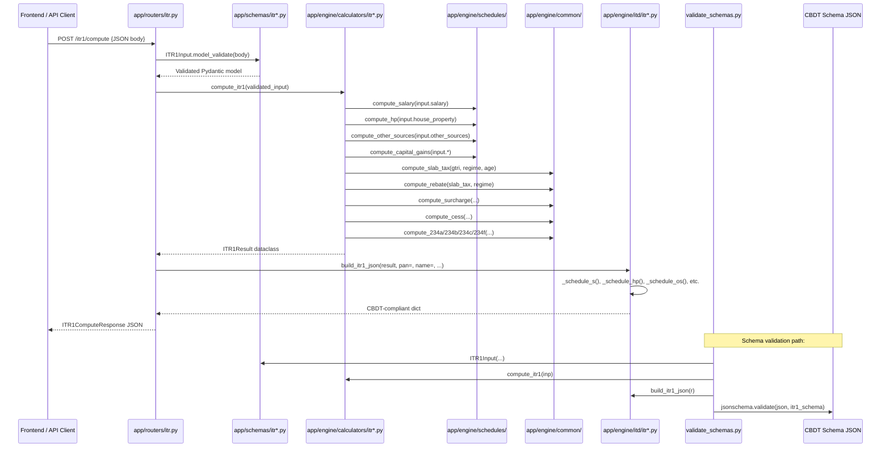

# Taxify ITR Computation Engine -- Architecture & Implementation Reference

> **Version:** 1.0 | **AY:** 2026-27 | **Last Updated:** 2026-07-21  
> **Purpose:** Definitive developer reference for the entire ITR computation pipeline across all four ITR forms (ITR-1 through ITR-4).

---

## Table of Contents

1. [Project Overview](#1-project-overview)
2. [High-Level Architecture & Data Flow](#2-high-level-architecture--data-flow)
3. [Shared Infrastructure](#3-shared-infrastructure)
   - [3.1 app/engine/common/ -- Shared Tax Engine](#31-appenginecommon----shared-tax-engine)
   - [3.2 app/engine/itd/common.py -- Shared ITD JSON Builder](#32-appengineitdcommonpy----shared-itd-json-builder)
   - [3.3 app/engine/constants.py -- Tax Constants](#33-appengineconstantspy----tax-constants)
4. [ITR-1 -- Complete Reference](#4-itr-1----complete-reference)
   - [4.1 Schema (app/schemas/itr1.py)](#41-schema-appschemasitr1py)
   - [4.2 Calculator (app/engine/calculators/itr1.py)](#42-calculator-appenginecalculatorsitr1py)
   - [4.3 ITD Builder (app/engine/itd/itr1.py)](#43-itd-builder-appengineitditr1py)
   - [4.4 API Endpoints](#44-api-endpoints)
   - [4.5 Test Coverage](#45-test-coverage)
5. [ITR-2 -- Complete Reference](#5-itr-2----complete-reference)
   - [5.1 Schema (app/schemas/itr2.py)](#51-schema-appschemasitr2py)
   - [5.2 Calculator (app/engine/calculators/itr2.py)](#52-calculator-appenginecalculatorsitr2py)
   - [5.3 ITD Builder (app/engine/itd/itr2.py)](#53-itd-builder-appengineitditr2py)
   - [5.4 Comparison with ITR-3](#54-comparison-with-itr-3)
6. [ITR-3 -- Complete Reference](#6-itr-3----complete-reference)
   - [6.1 Schema (app/schemas/itr3.py)](#61-schema-appschemasitr3py)
   - [6.2 PGBP Engine (app/engine/schedules/business.py)](#62-pgbp-engine-appengineschedulesbusinesspy)
   - [6.3 Calculator (app/engine/calculators/itr3.py)](#63-calculator-appenginecalculatorsitr3py)
   - [6.4 ITD Builder (app/engine/itd/itr3.py)](#64-itd-builder-appengineitditr3py)
7. [ITR-4 -- Complete Reference](#7-itr-4----complete-reference)
   - [7.1 Schema (app/schemas/itr4.py)](#71-schema-appschemasitr4py)
   - [7.2 Calculator (app/engine/calculators/itr4.py)](#72-calculator-appenginecalculatorsitr4py)
   - [7.3 ITD Builder (app/engine/itd/itr4.py)](#73-itd-builder-appengineitditr4py)
   - [7.4 API Endpoints](#74-api-endpoints)
   - [7.5 Test Coverage](#75-test-coverage)
8. [Shared Schedule Engines](#8-shared-schedule-engines)
   - [8.1 Income Schedules](#81-income-schedules)
   - [8.2 Deduction Schedules](#82-deduction-schedules)
   - [8.3 Loss Set-Off Schedules](#83-loss-set-off-schedules)
   - [8.4 TDS/TCS Schedules](#84-tdstcs-schedules)
   - [8.5 Other Schedules](#85-other-schedules)
9. [Router Layer & API Endpoints](#9-router-layer--api-endpoints)
   - [9.1 itr.py -- ITR Compute + Persistence](#91-itrpy----itr-compute--persistence)
   - [9.2 tax.py -- Frontend-Facing Compute](#92-taxpy----frontend-facing-compute)
   - [9.3 client_itr.py -- Client-Specific Endpoints](#93-client_itrpy----client-specific-endpoints)
   - [9.4 app/main.py -- FastAPI Entry Point](#94-appmainpy----fastapi-entry-point)
10. [CBDT Schema Validation](#10-cbdt-schema-validation)
11. [Test Coverage Summary](#11-test-coverage-summary)
12. [File-to-File Communication Matrix](#12-file-to-file-communication-matrix)
13. [ITR Form Comparison Table](#13-itr-form-comparison-table)

---

## 1. Project Overview

**Taxify** is a full-stack Indian Income Tax Return filing application. The backend is a **FastAPI** web application (Python 3.14) that accepts tax data through Pydantic input schemas, runs a multi-step computation pipeline, and produces CBDT-compliant ITD (Income Tax Department) JSON for submission to the Indian tax portal.

### Technology Stack

| Layer | Technology |
|---|---|
| Web Framework | FastAPI (Python 3.14) |
| Data Validation | Pydantic v2 |
| Database | SQLAlchemy ORM (PostgreSQL/SQLite) |
| Numeric Precision | `decimal.Decimal` for all monetary values |
| Testing | pytest with hypothesis |
| CBDT JSON | Hand-crafted ITD builders per form, validated against official schema JSON files |

### Core Design Principle: Three-Layer Architecture

Every ITR form follows the same three-layer pattern:

```
Input (Pydantic)  →  Calculator (Dataclass Result)  →  ITD Builder (CBDT JSON)
────────────────     ──────────────────────────────     ─────────────────────────
app/schemas/itr*.py  app/engine/calculators/itr*.py    app/engine/itd/itr*.py
```

1. **Schema Layer** (`app/schemas/`): Pydantic models validate all input data. Monetary fields use `Decimal` for precision. Enum fields constrain to CBDT-allowed values.
2. **Calculator Layer** (`app/engine/calculators/`): Pure functions that take the Pydantic input, delegate to shared schedule engines, apply tax law, and emit a flat dataclass result.
3. **ITD Builder Layer** (`app/engine/itd/`): Takes the calculator result and assembles a deeply nested JSON document matching the exact CBDT schema (with `additionalProperties: false` enforcement).

### Form Capabilities

| Feature | ITR-1 | ITR-4 | ITR-2 | ITR-3 |
|---|---|---|---|---|
| Salary | Yes | Yes | Yes | Yes |
| House Property | Yes (1) | Yes (1) | Yes (multi) | Yes (multi) |
| Other Sources | Yes | Yes | Yes | Yes |
| Capital Gains | LTCG 112A only | LTCG 112A only | Full CG | Full CG |
| PGBP / Business | No | Presumptive only | No | Full (non-spec, spec, specified) |
| Partner in Firm | No | No | No | Yes |
| VDA | No | No | Yes | Yes |
| Clubbing (SPI/5A) | No | No | Yes | Yes |
| Foreign Assets (FA) | No | No | Yes | Yes |
| AMT | No | No | Yes | Yes |
| CBDT JSON Output | Yes | Yes | Yes | Yes |
| API Endpoint | `/itr1/compute` | `/itr4/compute` | Internal only | `/itr3/compute` |

---

## 2. High-Level Architecture & Data Flow



### The Complete Computation Flow

Every calculator follows this general order:

```
1. Compute all heads of income (Salary, HP, PGBP, CG, OS, VDA)
2. Apply clubbing provisions (SPI / 5A entries)
3. Sum = Gross Total Income Before Loss Set-Off
4. CYLA: Current Year Loss Adjustment (HP→any, STCG→STCG+LTCG, LTCG→LTCG only, Biz→Biz only)
5. BFLA: Brought Forward Loss Adjustment (same-head losses from prior years, 4-8 year expiry)
6. GTI After Losses
7. Unabsorbed Depreciation set-off (business only, ITR-3)
8. Agricultural Income with Partial Integration
9. Chapter VI-A Deductions (80C through 80U)
10. Taxable Income = GTI - Deductions, rounded to nearest Rs 10
11. Special Rate Income Tax (112A @ 12.5%, 111A @ 20%, VDA @ 30%, lottery 115BB, etc.)
12. Normal Slab Tax on remaining income
13. AMT (if applicable — ITR-2/3 only)
14. Rebate u/s 87A (with marginal relief at regime threshold)
15. Surcharge (with marginal relief where income slightly exceeds threshold)
16. Health & Education Cess @ 4%
17. Foreign Tax Relief (90/91) — ITR-2/3 only
18. Interest: 234A (late filing), 234B (advance tax deficit), 234C (deferred advance tax), 234F (late fee)
19. Tax Credits: TDS (Salary + Other), TCS, Advance Tax, Self-Assessment Tax
20. Final: Payable or Refund
```

---

## 3. Shared Infrastructure

### 3.1 app/engine/common/ -- Shared Tax Engine

Located in `app/engine/common/`, these modules are imported by all four ITR calculators.

#### Module Map

| File | Function | Description |
|---|---|---|
| `rounding.py` | `vba_round(val: Decimal) -> Decimal` | Banker's rounding, VBA-compatible |
| `rounding.py` | `round_to_nearest_10(val: Decimal) -> Decimal` | Section 288A/288B rounding |
| `slab_tax.py` | `compute(base_income, regime, age_bracket)` | Progressive slab tax |
| `rebate.py` | `compute(slab_tax, regime, total_income)` | Section 87A rebate |
| `surcharge.py` | `compute(tax, regime, total_income)` | Surcharge with marginal relief |
| `cess.py` | `compute(tax_after_surcharge)` | 4% Health & Education Cess |
| `interest.py` | `compute_234a(tax, paid, filing_date, due_date)` | Late filing interest |
| `interest.py` | `compute_234b(tax, advance_tax, dates)` | Advance tax deficit interest |
| `interest.py` | `compute_234c(tax, installments, dates)` | Deferred advance tax interest |
| `interest.py` | `compute_234f(taxable_income, filing_date, due_date)` | Late fee |
| `aggregation.py` | `aggregate_tax(...)` | Final payable/refund calculation |

#### Slab Tax Rates (AY 2026-27)

**Old Regime:**

| Income Slab | Rate | Age Bracket |
|---|---|---|
| 0 - 2,50,000 | Nil | All |
| 2,50,001 - 3,00,000 | 5% | Below 60 only |
| 3,00,001 - 5,00,000 | 5% | 60-80 (3L basic exemption), Above 80 (5L basic exemption) |
| 2,50,001 - 5,00,000 | 5% | Below 60 |
| 5,00,001 - 10,00,000 | 20% | All |
| Above 10,00,000 | 30% | All |

**New Regime (Section 115BAC):**

| Income Slab | Rate |
|---|---|
| 0 - 4,00,000 | Nil |
| 4,00,001 - 8,00,000 | 5% |
| 8,00,001 - 12,00,000 | 10% |
| 12,00,001 - 16,00,000 | 15% |
| 16,00,001 - 20,00,000 | 20% |
| 20,00,001 - 24,00,000 | 25% |
| Above 24,00,000 | 30% |

**Section 87A Rebate:**

| Regime | Max Rebate | Income Threshold |
|---|---|---|
| Old | Rs 12,500 | Rs 5,00,000 |
| New | Rs 60,000 | Rs 12,00,000 |

#### Surcharge Rates

| Total Income | Rate (Old) | Rate (New) |
|---|---|---|
| Rs 50L - 1Cr | 10% | 10% |
| Rs 1Cr - 2Cr | 15% | 15% |
| Rs 2Cr - 5Cr | 25% | 25% |
| Above Rs 5Cr | 37% | 25% |

Marginal relief applies in all bands; the surcharge on the excess over the threshold is capped at the actual excess itself.

---

### 3.2 app/engine/itd/common.py -- Shared ITD JSON Builder

This module provides form-agnostic helpers used by all four ITD builders.

#### Key Functions

| Function | Purpose |
|---|---|
| `_to_rupees(val: Decimal) -> int` | Converts Decimal to integer rupees using VBA banker's rounding |
| `_to_rupees_rounded10(val: Decimal) -> int` | Rounds to nearest Rs 10 (Sec 288A/288B) |
| `_zero_if_none(val) -> Decimal` | Returns Decimal(0) for None |
| `_str_or(val, default) -> str` | Safe string conversion with fallback |
| `_creation_info() -> dict` | Generates `CreationInfo` block (SWVersionNo, SWCreatedBy, JSONCreationDate, IntermediaryCity, Digest) |
| `_form_itr(form_name) -> dict` | Generates `Form_ITRx` block (FormName, Description "For AY 2026-27", AssessmentYear "2026") |
| `_verification(name, father, pan, place, capacity) -> dict` | Generates `Verification` block (Declaration + Capacity + Place) |
| `_tax_return_preparer() -> dict` | Generates `TaxReturnPreparer` block (TRP ID, Name, Reimbursement) |
| `_personal_info_base(...) -> dict` | Shared PersonalInfo dict (PAN, name, address, DOB, employer category) |
| `_compute_digest(data) -> str` | 44-character SHA-256 hex digest of sorted JSON |

#### Digest Computation

```python
def _compute_digest(data: dict) -> str:
    raw = json.dumps(data, sort_keys=True, ensure_ascii=False, default=str)
    return hashlib.sha256(raw.encode()).hexdigest()
```

The digest is computed AFTER all schedules are assembled and is stored in `CreationInfo.Digest`. It acts as a tamper-evident checksum over the entire ITR JSON.

---

### 3.3 app/engine/constants.py -- Tax Constants

Centralized constants used across calculators and schedule engines:

- **Slab tables:** Old regime (3 age brackets: BELOW_60, SIXTY_TO_80, ABOVE_80) and New regime (flat)
- **Basic exemption limits:** Rs 2,50,000 (below 60), Rs 3,00,000 (60-80), Rs 5,00,000 (above 80)
- **Rebate thresholds:** Rs 5,00,000 (old), Rs 12,00,000 (new)
- **Surcharge bands:** [50L, 1Cr, 2Cr, 5Cr] with rates [10%, 15%, 25%, 37%]
- **Cess rate:** 4% Health & Education Cess
- **CII table:** Cost Inflation Index for AY 2026-27 (base: FY 2001-02 = 100)
- **Deduction limits:** 80C (1.5L), 80CCD(1B) (50K), 80CCD(2) (10% salary / 20% GTI for SE), 80D (25K/50K/1L), 80DD (75K/1.25L), 80DDB (40K/1L), 80E (unlimited), 80EEA (1.5L), 80G (multiple tiers), 80GGC (unlimited), 80TTA (10K), 80TTB (50K), 80U (75K/1.25L)
- **Capital gains rates:** 112A (12.5% beyond 1.25L), 111A (20%), VDA (30%), lottery 115BB (30%), 115BBE (60%), 115BBF (30%), 115BBG (30%)
- **Tolerance epsilon:** 1-rupee tolerance for tax equalization

---

## 4. ITR-1 -- Complete Reference

ITR-1 (Sahaj) is for resident individuals with salary, one house property, other sources (interest, dividend, family pension), and agricultural income up to Rs 5,000.

### 4.1 Schema (app/schemas/itr1.py)

**File:** `app/schemas/itr1.py` (415 lines)

#### Enums

```python
class AgeBracket(str, Enum):
    BELOW_60 = "BELOW_60"
    SIXTY_TO_80 = "SIXTY_TO_80"
    ABOVE_80 = "ABOVE_80"

class TaxRegime(str, Enum):
    OLD = "OLD"
    NEW = "NEW"

class PropertyType(str, Enum):
    SELF_OCCUPIED = "S"
    LET_OUT = "L"
    DEEMED_LET_OUT = "D"
```

#### Models

| Model | Key Fields | Validation |
|---|---|---|
| `SalaryIncome` | `gross_salary` (Decimal), `perquisites` (Decimal), `hra_exempt` (Decimal), `lta_exempt` (Decimal), `standard_deduction` (Decimal, default=75000), `entertainment_allowance` (Decimal), `professional_tax` (Decimal) | All non-negative; standard_deduction capped at 75000; entertainment_allowance capped at 5000; professional_tax capped at 2500 |
| `HousePropertyIncome` | `property_type` (PropertyType), `annual_lettable_value` (Decimal), `municipal_taxes_paid` (Decimal), `interest_on_housing_loan` (Decimal), `arrears_unrealized_rent_received` (Decimal) | Single property only; interest capped at 2L for self-occupied, unlimited for let-out |
| `OtherSourcesIncome` | `savings_interest` (Decimal), `fd_interest` (Decimal), `family_pension` (Decimal), `dividend_income` (Decimal), `other_income` (Decimal) | All non-negative |
| `CapitalGainsIncome` | `ltcg_112a` (Decimal) | Capped at 1.25L exemption; only LTCG 112A (listed equity shares/MF with STT) |
| `Donation80G` | `donee_name` (str), `pan` (str), `amount` (Decimal), `eligibility_percent` (int: 50/100) | PAN required for 100% eligibility |
| `Chapter6ADeductions` | `80c`, `80ccc`, `80ccd_employee`, `80ccd_1b`, `80ccd_employer`, `80d`, `80dd`, `80ddb`, `80e`, `80ee`, `80eea`, `80eeb`, `80g`, `80gg`, `80gga`, `80ggc`, `80qqb`, `80rrb`, `80tta`, `80ttb`, `80u`, `any_other_80cch` (all Decimal); `donations_80g` (list[Donation80G]) | Pool limits: 80C+80CCC+80CCD(1) ≤ 1.5L; 80CCD(1B) ≤ 50K; 80CCD(2) ≤ 10% salary; 80D ≤ 25K/50K/1L |
| `ITR1Input` | `age_bracket`, `tax_regime`, `residential_status`, `return_filed_under_section` (int, default=11), `salary`, `house_property`, `other_sources`, `capital_gains`, `chapter_6a`, `tds1_entries`, `tds2_entries`, `tcs_entries`, `advance_tax`, `self_assessment_tax`, `filing_date`, `due_date` | Enforces ITR-1 eligibility: no business income, only one house property, no foreign assets |

#### TDS/TCS Entry Models

```python
class TDS1Entry(BaseModel):
    employer_tan: str
    income_chargeable: Decimal
    tds_deducted: Decimal

class TDS2Entry(BaseModel):
    deductor_tan: str
    tds_section: str
    gross_amount: Decimal
    tds_deducted: Decimal

class TCSEntry(BaseModel):
    collector_tan: str
    tcs_section: str
    gross_amount: Decimal
    tcs_collected: Decimal
```

---

### 4.2 Calculator (app/engine/calculators/itr1.py)

**File:** `app/engine/calculators/itr1.py` (227 lines)

#### Result Dataclass

```python
@dataclass
class ITR1Result:
    salary_income: Decimal          # Net salary after deductions
    house_property_income: Decimal  # Can be negative (loss)
    other_sources_income: Decimal
    gross_total_income: Decimal     # Sum of all heads (min 0 for HP)
    deductions_total: Decimal
    taxable_income: Decimal         # GTI - deductions, rounded to Rs 10
    slab_tax: Decimal               # Normal slab rate tax
    special_rate_tax: Decimal       # 112A @ 12.5% on amount exceeding 1.25L
    rebate_87a: Decimal             # 87A rebate
    tax_after_rebate: Decimal
    surcharge: Decimal              # With marginal relief
    health_education_cess: Decimal  # 4%
    total_tax_liability: Decimal    # Before credits and interest
    interest_234a: Decimal          # Late filing interest
    interest_234b: Decimal          # Advance tax deficit
    interest_234c: Decimal          # Deferred advance tax
    late_fee_234f: Decimal          # Late filing fee
    total_interest: Decimal         # Sum of all interest + late fee
    net_tax_liability: Decimal      # Tax + interest - credits
    total_tds: Decimal
    total_tcs: Decimal
    total_advance_tax: Decimal
    total_self_assessment_tax: Decimal
    total_taxes_paid: Decimal
    balance_payable: Decimal
    refund_due: Decimal
    hp_loss_disallowed: Decimal     # Excess HP loss beyond 2L limit
```

#### compute() Function -- 12-Step Pipeline

```python
def compute(input_data: ITR1Input) -> ITR1Result:
```

**Step 1: Heads of Income**
```python
salary_income = compute_salary(input_data.salary)     # gross - std_deduction - prof_tax
hp_income = compute_hp(input_data.house_property)      # ALV - tax - 30% - interest
os_income = compute_other_sources(input_data.other)    # sum of all OS components
cg_112a = compute_capital_gains(input_data.cg)         # max(0, ltcg_112a - 125000)
```

**Step 2: Gross Total Income & Eligibility**
```python
gti = max(0, salary_income) + max(0, hp_income) + os_income + cg_112a
if gti > 50_00_000:
    raise ValueError("ITR-1 not allowed if GTI exceeds Rs 50 lakh")
hp_loss_disallowed = max(0, abs(hp_income) - 200000) if hp_income < 0 else 0
```

**Step 3: Chapter VI-A Deductions**
```python
deductions = compute_chapter_6a(input_data.chapter_6a, input_data.tax_regime)
# New regime: most deductions unavailable; only 80CCD(2) allowed
```

**Step 4: Taxable Income (rounded to Rs 10)**
```python
taxable_income = round_to_nearest_10(max(0, gti - deductions))
```

**Step 5: Normal Slab Tax**
```python
slab_tax = compute_slab_tax(taxable_income, regime=old, age=input_data.age_bracket)
```

**Step 6: Special Rate Tax**
```python
if cg_112a > 125000:
    special_rate_tax = (cg_112a - 125000) * Decimal("0.125")
else:
    special_rate_tax = 0
```

**Step 7: Rebate u/s 87A**
```python
rebate = compute_rebate(slab_tax + special_rate_tax, regime, gti)
```

**Step 8: Surcharge**
```python
surcharge = compute_surcharge(slab_tax, regime, total_income_with_112a)
```

**Step 9: Health & Education Cess**
```python
cess = compute_cess(slab_tax + special_rate_tax - rebate + surcharge)
```

**Step 10: Interest and Late Fee**
```python
if filing_date and due_date:
    interest_234a = compute_234a(tax_liability, taxes_paid, filing_date, due_date)
    interest_234b = compute_234b(tax_liability, advance_tax, dates)
    interest_234c = compute_234c(tax_liability, installments, dates)
    late_fee_234f = compute_234f(taxable_income, filing_date, due_date)
```

**Step 11: Tax Credits**
```python
total_tds = sum(e.tds_deducted for e in tds1) + sum(e.tds_deducted for e in tds2)
total_tcs = sum(e.tcs_collected for e in tcs_entries)
total_taxes_paid = total_tds + total_tcs + advance_tax + self_assessment_tax
```

**Step 12: Final Payable/Refund**
```python
net_liability = tax + cess + surcharge + interest - rebate - total_taxes_paid
# Positive = payable, Negative = refund
```

---

### 4.3 ITD Builder (app/engine/itd/itr1.py)

**File:** `app/engine/itd/itr1.py` (497 lines)

#### Public API

```python
def build_itr1_json(
    result: ITR1Result,
    pan: str,
    first_name: str, middle_name: str, last_name: str,
    dob: str,
    residence_no: str, locality: str, city: str,
    state_code: str, country_code: str,
    residential_status: str = "RES",
    return_file_sec: int = 11,
    mobile_no: Optional[str] = None,
    email: Optional[str] = None,
    aadhaar: Optional[str] = None,
) -> dict:
```

Returns `{"ITR": {"ITR1": { ... }}}`.

#### Internal Builder Functions

| Function | Produces | Description |
|---|---|---|
| `_parta_gen1()` | `PartA_GEN1` | PersonalInfo + FilingStatus, including regime opt-out flag |
| `_filing_status_itr1()` | `FilingStatus` | ReturnFileSec, ResidentialStatus, regime flags |
| `_income_deductions_itr1()` | `IncomeDeductions` | Salary, HP, OS, GTI, VI-A deductions, taxable income |
| `_tax_computation_itr1()` | `TaxComputation` | Slab tax, rebate, surcharge, cess, interest, late fee, net liability |
| `_tax_paid_itr1()` | `TaxPaid` | TDS, TCS, advance tax, self-assessment tax, total |
| `_refund_itr1()` | `Refund` | Refund amount + bank account details |
| `_schedule_80d()` | `Schedule80D` | Health insurance premium break-out |
| `_schedule_80c()` | `Schedule80C` | 80C deductions (LIC, PPF, ELSS, etc.) |
| `_schedule_80g()` | `Schedule80G` | Charitable donations with eligible amounts |
| `_schedule_ea10_13a()` | `ScheduleEA` | HRA exemption detail under 10(13A) |
| `_ltcg_112a_schedule()` | `Schedule112A` | LTCG 112A detail with STT details |
| `_tds_salary_schedule_itr1()` | `ScheduleTDS1` | TDS on salary from Form 16 |
| `_tds_other_schedule_itr1()` | `ScheduleTDS2` | TDS on other income from Form 16A |
| `_chapter_via_itr1()` | `ScheduleVIA` | Complete 80C-80U deduction mapping |

#### Final Assembly

```python
itr1 = {
    "CreationInfo": _creation_info(),
    "Form_ITR1": _form_itr("ITR-1"),
    "PartA_GEN1": _parta_gen1(...),
    "FilingStatus": _filing_status_itr1(...),
    "IncomeDeductions": _income_deductions_itr1(result),
    "TaxComputation": _tax_computation_itr1(result),
    "TaxPaid": _tax_paid_itr1(result),
    "Refund": _refund_itr1(result),
    "ScheduleS": _schedule_s(result),
    "ScheduleHP": _schedule_hp(result),
    "ScheduleOS": _schedule_os(result),
    "Schedule112A": _ltcg_112a_schedule(result),
    "ScheduleVIA": _chapter_via_itr1(result),
    "Schedule80D": _schedule_80d(input_data),
    "Schedule80C": _schedule_80c(input_data),
    "Schedule80G": _schedule_80g(input_data),
    "ScheduleTDS1": _tds_salary_schedule_itr1(tds1_entries),
    "ScheduleTDS2": _tds_other_schedule_itr1(tds2_entries),
    "Verification": _verification(name, father, pan, place),
    "TaxReturnPreparer": _tax_return_preparer(),
}
```

---

### 4.4 API Endpoints

| Route | Method | Input | Output |
|---|---|---|---|
| `/itr1/compute` | POST | `ITR1Input` (Pydantic) | `ITR1ComputeResponse` (15 fields) |
| `/returns/save` | POST | `SaveRequest` (itr_type="ITR1") | `SaveResponse` (id) |
| `/returns` | GET | - | `list[ReturnSummary]` |
| `/returns/{id}` | GET | - | `ReturnDetail` |

The `ITR1ComputeResponse` contains: `salary_income`, `house_property_income`, `other_sources_income`, `gross_total_income`, `deductions_chapter6a`, `taxable_income`, `slab_tax`, `rebate_87a`, `tax_after_rebate`, `surcharge`, `health_education_cess`, `total_tax_payable`, `hp_loss_disallowed`.

The response builder maps the dataclass to the response model with two field renames:
- `deductions_total` → `deductions_chapter6a`
- `net_tax_liability` → `total_tax_payable`

---

### 4.5 Test Coverage

#### tests/test_itr1_schemas.py (6 tests)

| Test | What it validates |
|---|---|
| `test_salary_income_valid` | Default values produce valid model |
| `test_salary_income_invalid` | Negative gross_salary raises ValidationError |
| `test_house_property_income_valid` | All 3 property types work |
| `test_house_property_income_invalid` | Negative interest rejected |
| `test_other_sources_income` | Valid & invalid |
| `test_chapter6a_deductions` | Valid & invalid |
| `test_capital_gains_income` | Valid & invalid |
| `test_itr1_input_full` | End-to-end instantiation |

#### tests/test_itr1_calculator.py (14 scenarios)

| Test | Scenario | Expected |
|---|---|---|
| `test_itr1_no_income` | Zero across all heads | All zeros |
| `test_itr1_old_regime_rebate_applies` | 5L income, old regime | Rs 5,000 rebate |
| `test_itr1_old_regime_high_income` | 14.03L taxable | Rs 2,33,400 slab tax |
| `test_itr1_new_regime_high_income` | 15.28L taxable | Rs 1,09,200 slab tax |
| `test_itr1_senior_citizen_old_regime` | Self-occupied HP loss + 80TTB | Correct slab + deductions |
| `test_itr1_new_regime_marginal_rebate` | 12.05L income | Marginal 87A relief |
| `test_professional_tax_cap_old_regime` | Rs 8,000 PT | Capped at Rs 2,500 |
| `test_entertainment_allowance_non_govt` | Rs 0 deduction | |
| `test_entertainment_allowance_govt` | Capped at Rs 5,000 | |
| `test_80ccd1b_limit` | Rs 70,000 | Capped at Rs 50,000 |
| `test_80cce_pool_limit` | 80C+80CCC+80CCD(1) > 1.5L | Pooled at 1.5L |
| `test_json_output_keys` | Output has all required attrs | |

---

## 5. ITR-2 -- Complete Reference

ITR-2 is for individuals and HUFs not having business/profession income. It covers full capital gains (STCG, LTCG, 112A, VDA), foreign assets, clubbing of income, and AMT.

### 5.1 Schema (app/schemas/itr2.py)

**File:** `app/schemas/itr2.py` (259 lines)

ITR-2's schema is the most expressive of all forms. It serves as the **shared type library** — ITR-3 imports heavily from ITR-2.

```python
# ITR-3 reuses these types from ITR-2:
from app.schemas.itr2 import (
    SalaryEntry, HousePropertyEntry, CG112ATransaction,
    STCG111ATransaction, LandBuildingTransaction,
    CGExemption, CYLAEntry, BFLAEntry, CFLEntry,
    SIEntry, EI_AgriEntry, EI_OtherEntry, EI_DTAAEntry,
    FSIEntry, TREntry, FAEntry, SPISpecifiedPersonEntry,
    AMTEntry, VDATransaction, Schedule5AEntry, ESOPEntry,
    OtherSourcesEntry, FamilyPensionEntry, DividendEntry,
    WinningsEntry, GiftEntry,
)
```

#### Capital Gains Types (unique to ITR-2/3)

| Model | Fields | Purpose |
|---|---|---|
| `CG112ATransaction` | `isin`, `name_of_share`, `sale_price`, `fmv_31jan2018`, `cost_of_acquisition`, `stt_paid` (bool), `exemption_claimed` (Decimal) | LTCG 112A — listed equity with STT |
| `STCG111ATransaction` | `isin`, `name_of_share`, `sale_price`, `cost_of_acquisition`, `stt_paid` (bool) | STCG 111A @ 20% |
| `LandBuildingTransaction` | `property_address`, `sale_consideration`, `cost_of_acquisition`, `cost_of_improvement`, `year_of_acquisition`, `stamp_duty_value`, `exemption_claimed` | Immovable property CG |
| `CGExemption` | `section` (enum: 54/54B/54EC/54F), `amount`, `asset_details` | CG exemptions |
| `VDATransaction` | `asset_description`, `transfer_date`, `sale_consideration`, `cost_of_acquisition` | Virtual Digital Assets @ 30% |

#### Other Schedule Types

| Model | Fields | Purpose |
|---|---|---|
| `CYLAEntry` | `ay`, `loss_category` (enum: HP/STCG/LTCG/BUS_SPEC/BUS_NON_SPEC/OS_RACE), `loss_amount`, `set_off_amount`, `carried_forward` | Current Year Loss Adjustment |
| `BFLAEntry` | `ay`, `loss_category`, `brought_forward_loss`, `set_off_amount`, `remaining_loss` | Brought Forward Loss Adjustment |
| `CFLEntry` | `ay`, `loss_category`, `carried_forward_loss` | Carried Forward Losses |
| `SIEntry` | `section_code`, `special_rate_percent`, `income`, `tax` | Special Income (lottery, 115BBE, etc.) |
| `EI_AgriEntry` | `description`, `amount` | Agricultural income |
| `EI_OtherEntry` | `section`, `description`, `amount` | Other exempt income |
| `EI_DTAAEntry` | `country`, `article`, `income_type`, `amount` | DTAA-exempt income |
| `FSIEntry` | `country_name`, `tax_id`, `income`, `tax_paid`, `relief_claimed` | Foreign Source Income |
| `TREntry` | `country`, `tax_paid`, `relief_available` | Tax Relief (90/91) |
| `FAEntry` | `country`, `asset_type`, `asset_description`, `peak_balance`, `closing_balance`, `income_from_asset` | Foreign Assets |
| `SPISpecifiedPersonEntry` | `spouse_name`, `spouse_pan`, `salary_clubbed`, `hp_clubbed`, `cg_clubbed`, `os_clubbed`, `total_clubbed` | Clubbing of Income |
| `Schedule5AEntry` | `spouse_name`, `spouse_pan`, `spouse_aadhaar`, `income_transferred`, `tax_withheld` | Section 5A (Portuguese Civil Code) |
| `AMTEntry` | `income_before_amt`, `amt_rate` (18.5%), `amt_tax`, `regular_tax`, `amt_payable` | Alternate Minimum Tax |
| `ESOPEntry` | `startup_name`, `dpiit_reg_no`, `shares_allotted`, `fmv`, `exercise_price`, `perquisite_value`, `tax_deferred` | ESOP from eligible startups |

---

### 5.2 Calculator (app/engine/calculators/itr2.py)

**File:** `app/engine/calculators/itr2.py` (298 lines)

The ITR-2 calculator extends the standard pipeline with full capital gains computation:

#### Full Computation Pipeline

```
1. Salary Income
2. House Property Income (multiple properties supported)
3. Capital Gains:
   a. STCG 111A: each transaction → (sale - cost) → sum → 111A income
   b. LTCG 112A: each transaction → (sale - max(fmv, cost)) → sum
      → exemption = min(1.25L, ltcg_total) → taxable = ltcg_total - exemption
   c. Land/Building: each → (sale - indexed_cost - improvement - exemption) → sum
   d. VDA: each → (sale - cost) → sum → 30% rate
4. Other Sources
5. Clubbing Income (SPI entries)
6. GTI Before Loss Set-Off
7. CYLA: HP loss → salary/HP/OS/CG; STCG loss → STCG+LTCG;
            LTCG loss → LTCG; Non-spec biz → any except salary;
            Spec biz → spec biz only; OS race horse → race horse only
8. BFLA: Same-head losses from prior 4-8 years (depending on loss type)
9. GTI After Losses
10. Schedule CFL: Carried-forward losses for next year
11. Agricultural Income + Partial Integration
12. Chapter VI-A Deductions
13. Taxable Income (rounded to Rs 10)
14. Special Rate Tax: 112A(12.5%), 111A(20%), VDA(30%), lottery(30%), 115BBE(60%)
15. Normal Slab Tax on (taxable_income - special_rate_income)
16. AMT: if AMT_tax > regular_tax, use AMT
17. Rebate 87A
18. Surcharge + Marginal Relief
19. Cess 4%
20. Foreign Tax Relief (90/91)
21. Interest: 234A, 234B, 234C
22. Late Fee: 234F
23. Tax Credits: TDS1, TDS2, TDS3 (property), TCS
24. Final: Payable or Refund
```

---

### 5.3 ITD Builder (app/engine/itd/itr2.py)

**File:** `app/engine/itd/itr2.py` (685 lines)

The ITR-2 ITD builder is the most comprehensive, producing a CBDT-compliant JSON with 20+ schedules.

#### Required Schedules (always present)

- `CreationInfo`, `Form_ITR2`
- `PartA_GEN1` -- PersonalInfo + FilingStatus (ITR-2 version: `OptOutNewTaxRegime`, `AsseseeRepFlg`)
- `ScheduleCYLA`, `ScheduleBFLA`
- `PartB-TI`, `PartB_TTI`
- `Verification`

#### Conditional Schedules (based on data)

| Schedule | When Present | Builds |
|---|---|---|
| `ScheduleS` | salary > 0 | Gross salary, perquisites, 89A, deductions, net salary |
| `ScheduleHP` | HP entries exist | Property details, ALV, interest, co-ownership |
| `ScheduleOS` | OS entries exist | Interest, dividend, winnings, pension, gifts, others |
| `ScheduleCGFor23` | CG present | Full STCG + LTCG + exemptions + loss setoff + accrual dates |
| `Schedule112A` | LTCG 112A > 0 | ISIN-level detail, FMV, COA, STT flag |
| `ScheduleVDA` | VDA present | Transaction-level VDA detail |
| `ScheduleCFL` | CF losses exist | Per-AY loss carry forwards |
| `ScheduleVIA` | deductions > 0 | Full 80C-80U mapping |
| `ScheduleSI` | special rate inc > 0 | Section-wise special rate detail |
| `ScheduleEI` | exempt inc > 0 | Agricultural, exempt, DTAA |
| `Schedule115AD` | NRI entries | Foreign institutional investor CG |
| `ScheduleTR1` | TR entries exist | Section 90/91 relief |
| `ScheduleFA` | FA entries exist | Foreign bank accounts, assets, beneficial interests |
| `ScheduleAL` | income > 25L | Asset-Liability statement |
| `Schedule5A2014` | 5A entries exist | Portuguese Civil Code income |
| `ScheduleESOP` | ESOP entries exist | Deferred ESOP tax |
| `Schedule80C/D/G/GGA/GGC/DD/U/E/EE/EEA/EEB` | respective deductions > 0 | |
| `ScheduleTDS1/2/3` | TDS present | Form 16 / 16A / 26QB |
| `ScheduleTCS` | TCS present | Form 27D |
| `ScheduleIT` | advance/SA tax > 0 | Challan details |

---

### 5.4 Comparison with ITR-3

ITR-2 and ITR-3 share nearly all schedules. The key difference: **ITR-3 adds business income schedules** while ITR-2 has none.

| Schedule | ITR-2 | ITR-3 |
|---|---|---|
| ITR3ScheduleBP | No | Yes (core PGBP) |
| PARTA_BS | No | Yes (Balance Sheet) |
| PARTA_PL | No | Yes (Profit & Loss) |
| PartA_GEN2 | No | Yes (AuditInfo, NatOfBus) |
| ScheduleDEP | No | Yes (Depreciation) |
| ScheduleDCG | No | Yes (Deemed CG on dep assets) |
| ScheduleDPM | No | Yes (Plant & Machinery) |
| ScheduleDOA | No | Yes (Depreciation on Other Assets) |
| ScheduleIF | No | Yes (Interest from Firms) |
| ScheduleGST | No | Yes (GST details) |
| ScheduleICDS | No | Yes (ICDS) |
| ScheduleESR | No | Yes (Scientific Research) |
| ScheduleTPSA | No | Yes (TPSA / 92CE) |
| Schedule80_IA/IB/IC | No | Yes (business deductions) |
| Schedule10AA | No | Yes (SEZ deduction) |
| ScheduleUD | No | Yes (Unabsorbed Depreciation) |
| ManufacturingAccount | No | Yes |
| TradingAccount | No | Yes |
| PARTA_OI | No | Yes (Other Information) |
| PARTA_QD | No | Yes (Quantitative Details) |
| PartA_GEN1 FilingStatus | `OptOutNewTaxRegime` | `IncFrmBusOrProf`, `ForeignExchangeFlag` |

---

## 6. ITR-3 -- Complete Reference

ITR-3 is for individuals and HUFs having business or profession income. It is the most complex form, with distinct PGBP schedules, balance sheet, profit & loss account, and all ITR-2 schedules.

### 6.1 Schema (app/schemas/itr3.py)

**File:** `app/schemas/itr3.py` (253 lines)

Imports heavily from `app.schemas.itr1` (basic types: AgeBracket, TaxRegime, SalaryIncome, HousePropertyIncome, CapitalGainsIncome, Chapter6ADeductions) and `app.schemas.itr2` (CG types, CYLA/BFLA/CFL, SI, EI, FSI, TR, FA, SPI, AMT, VDA, 112A).

#### ITR-3-Specific Models

**BusinessIncome** (core PGBP input):
```python
class BusinessIncome(BaseModel):
    # Primary Profit
    net_profit_before_tax: Decimal          # From P&L account

    # Disallowances (added back to profit)
    disallowance_u36: Decimal               # Section 36 disallowances
    disallowance_u37: Decimal               # Section 37 (capital/penal/personal)
    disallowance_u40: Decimal               # Section 40 amounts not deductible
    disallowance_u40a: Decimal              # Section 40A expenses/ payments
    disallowance_u43b: Decimal              # Section 43B amounts now allowable

    # Deemed Incomes (added to profit)
    deemed_income_u41: Decimal              # Recovery of earlier deduction
    deemed_income_u32ad: Decimal            # Investment allowance recapture
    deemed_income_u33ab: Decimal            # Tea/coffee/rubber development recapture
    deemed_income_u33aba: Decimal           # Site restoration fund recapture
    deemed_income_u35aba: Decimal            # R&D recapture
    deemed_income_u35abb: Decimal            # R&D recapture (2)
    deemed_income_u40a3a: Decimal           # Cash payments recapture
    deemed_income_u72a: Decimal              # Carry forward recapture
    deemed_income_u80hhd: Decimal            # Export recapture
    deemed_income_u80ia: Decimal             # Infrastructure recapture
    deemed_income_u43ca: Decimal             # Stock transfer

    # Depreciation
    depreciation_books: Decimal             # Depreciation as per Companies Act
    depreciation_it: Decimal                # Depreciation as per IT Act (Sec 32)
    additional_depreciation: Decimal        # Section 32(1)(iia)

    # ICDS Adjustments
    icds_adjustment: Decimal                # ICDS profit increase/decrease

    # Speculative Business (separate basket)
    speculative_net_pl: Decimal
    speculative_additions: Decimal
    speculative_deductions: Decimal

    # Specified Business (Section 35AD)
    specified_net_pl: Decimal
    specified_additions: Decimal
    specified_deductions: Decimal
```

**BalanceSheet:**
```python
class BalanceSheet(BaseModel):
    proprietors_fund: Decimal           # Capital + Reserves
    secured_loans: Decimal
    unsecured_loans: Decimal
    deferred_tax_liability: Decimal
    current_liabilities: Decimal
    fixed_assets: Decimal               # Gross block
    accumulated_depreciation: Decimal   # Depreciation to date
    net_block: Decimal                  # Fixed assets net
    capital_work_in_progress: Decimal
    investments: Decimal
    current_assets: Decimal
    loans_and_advances: Decimal
    miscellaneous_expenditure: Decimal
    total_funds: Decimal                # Must equal sources side
```

**AuditInfo:**
```python
class AuditInfo(BaseModel):
    account_audited: bool = False
    liable_44ab: bool = False           # Tax audit required
    liable_44aa: bool = False           # Books of accounts
    liable_92e: bool = False            # Transfer pricing
    audit_acknowledgment_num: Optional[str] = None
```

**NatureOfBusiness:**
```python
class NatureOfBusiness(BaseModel):
    business_code: str                  # CBDT nature of business code
    description: str
```

**PartnerInFirm:**
```python
class PartnerInFirm(BaseModel):
    firm_name: str
    firm_pan: str
    profit_share: Decimal
    interest: Decimal
    remuneration: Decimal
    capital_balance: Decimal
```

**UDEntry** (Unabsorbed Depreciation):
```python
class UDEntry(BaseModel):
    assessment_year: str
    depreciation_amount: Decimal
    set_off_this_year: Decimal
    carried_forward: Decimal
```

**ITR3Input** (top-level):
```python
class ITR3Input(BaseModel):
    age_bracket: AgeBracket
    tax_regime: TaxRegime
    residential_status: str
    return_filed_under_section: int = 44
    business_income: BusinessIncome
    audit_info: AuditInfo
    nature_of_business: list[NatureOfBusiness]
    balance_sheet: Optional[BalanceSheet] = None
    partners_in_firm: list[PartnerInFirm] = []
    ud_entries: list[UDEntry] = []
    # Plus all ITR-2-compatible schedules:
    salary: Optional[SalaryIncome] = None
    house_properties: list[HousePropertyEntry] = []
    capital_gains: Optional[CapitalGainsBundle] = None
    other_sources: Optional[OtherSourcesBundle] = None
    cg_transactions: list[...] = []
    bf_losses: list[BFLAEntry] = []
    si_entries: list[SIEntry] = []
    agri_entries: list[EI_AgriEntry] = []
    exempt_entries: list[EI_OtherEntry] = []
    dtaa_entries: list[EI_DTAAEntry] = []
    foreign_entries: list[FSIEntry] = []
    fa_entries: list[FAEntry] = []
    spi_entries: list[SPISpecifiedPersonEntry] = []
    amt_entries: list[AMTEntry] = []
    deductions: Optional[Chapter6ADeductions] = None
    tds1_entries: list[TDS1Entry] = []
    tds2_entries: list[TDS2Entry] = []
    tcs_entries: list[TCSEntry] = []
    advance_tax: Decimal = 0
    self_assessment_tax: Decimal = 0
    filing_date: Optional[date] = None
    due_date: Optional[date] = None
```

---

### 6.2 PGBP Engine (app/engine/schedules/business.py)

**File:** `app/engine/schedules/business.py` (117 lines)

This is the core PGBP (Profits and Gains of Business or Profession) computation engine, used exclusively by ITR-3.

#### Result Dataclass

```python
@dataclass
class PGBPResult:
    non_spec_net_income: Decimal       # Non-speculative business net income
    non_spec_depreciation_books: Decimal
    non_spec_depreciation_it: Decimal
    speculative_net_income: Decimal    # Speculative business (e.g., intra-day)
    specified_net_income: Decimal      # Specified business (35AD)
    total_business_income: Decimal     # Sum of all 3 baskets
```

#### compute_pgbp() Logic

```python
def compute_pgbp(input_data: BusinessIncome) -> PGBPResult:
    # Non-Speculative Business
    additions = (
        input_data.disallowance_u36
        + input_data.disallowance_u37
        + input_data.disallowance_u40
        + input_data.disallowance_u40a
        + input_data.disallowance_u43b
        + input_data.deemed_income_u41
        + input_data.deemed_income_u32ad
        + input_data.deemed_income_u33ab
        + input_data.deemed_income_u33aba
        + input_data.deemed_income_u35aba
        + input_data.deemed_income_u35abb
        + input_data.deemed_income_u40a3a
        + input_data.deemed_income_u72a
        + input_data.deemed_income_u80hhd
        + input_data.deemed_income_u80ia
        + input_data.deemed_income_u43ca
    )
    deductions = 0  # User-provided deductions specific to non-spec

    profit_after_additions = input_data.net_profit_before_tax + additions - deductions

    # Depreciation adjustment: IT depreciation replaces books depreciation
    depreciation = input_data.depreciation_it - input_data.depreciation_books

    # ICDS adjustment
    icds = input_data.icds_adjustment

    non_spec_net = profit_after_additions + depreciation + icds

    # Speculative Business
    speculative_net = (
        input_data.speculative_net_pl
        + input_data.speculative_additions
        - input_data.speculative_deductions
    )

    # Specified Business (35AD)
    specified_net = (
        input_data.specified_net_pl
        + input_data.specified_additions
        - input_data.specified_deductions
    )

    total = non_spec_net + speculative_net + specified_net

    return PGBPResult(
        non_spec_net_income=non_spec_net,
        non_spec_depreciation_books=input_data.depreciation_books,
        non_spec_depreciation_it=input_data.depreciation_it,
        speculative_net_income=speculative_net,
        specified_net_income=specified_net,
        total_business_income=total,
    )
```

---

### 6.3 Calculator (app/engine/calculators/itr3.py)

**File:** `app/engine/calculators/itr3.py` (349 lines)

The ITR-3 calculator is the most complex, with a 27-step pipeline:

#### ITR3Result Dataclass (40+ fields)

```python
@dataclass
class ITR3Result:
    business_income: Decimal
    salary_income: Decimal
    house_property_income: Decimal
    capital_gains_income: Decimal
    other_sources_income: Decimal
    vda_income: Decimal
    clubbing_income: Decimal
    partner_firm_income: Decimal

    gti_before_loss_setoff: Decimal
    cyla_total_set_off: Decimal
    bfla_total_set_off: Decimal
    gti_after_loss_setoff: Decimal
    gross_total_income: Decimal

    net_agricultural_income: Decimal
    partial_integration_tax: Decimal

    deductions_partb_chapter6a: Decimal
    deductions_partc_chapter6a: Decimal
    deductions_10aa: Decimal
    deductions_80ia: Decimal
    deductions_80ib: Decimal
    deductions_80ic: Decimal
    deductions_total: Decimal

    taxable_income: Decimal
    aggregate_income: Decimal

    slab_tax: Decimal
    special_rate_tax: Decimal
    amt_tax: Decimal
    total_tax_before_relief: Decimal
    tax_before_rebate: Decimal
    rebate_87a: Decimal
    tax_after_rebate: Decimal
    surcharge: Decimal
    health_education_cess: Decimal
    gross_tax_liability: Decimal

    relief_89: Decimal
    relief_90_91: Decimal

    interest_234a: Decimal
    late_fee_234f: Decimal
    total_interest: Decimal

    net_tax_liability: Decimal

    total_tds: Decimal
    total_tcs: Decimal
    total_advance_tax: Decimal
    total_self_assessment_tax: Decimal
    total_taxes_paid: Decimal

    balance_payable: Decimal
    refund_due: Decimal

    hp_loss_disallowed: Decimal
    cyla_remaining: Decimal
    bfla_remaining: Decimal
    unabsorbed_dep_setoff: Decimal

    schedules: dict  # Contains 'pgbp', 'cg', 'cyla', etc.
```

#### 27-Step Computation Pipeline

```
Step  1: Business Income via compute_pgbp()
Step  2: Salary via compute_salary()
Step  3: House Property via compute_hp()
Step  4: Capital Gains: STCG 111A + LTCG 112A + Land/Building + VDA
Step  5: Other Sources
Step  6: Clubbing Income (SPI entries + Section 5A)
Step  7: Partner in Firm Income (share of profit, interest, remuneration)
Step  8: GTI Before Loss Set-Off = sum(Steps 1-7)
Step  9: CYLA: Current Year Loss Adjustment
Step 10: BFLA: Brought Forward Loss Adjustment
Step 11: GTI After Losses
Step 12: Unabsorbed Depreciation Set-Off (from UD entries)
Step 13: Agricultural Income + Partial Integration
Step 14: Chapter VI-A Deductions (Part B: 80C-80U)
Step 15: Business-Specific Deductions (Part C: 80IA, 80IB, 80IC, 10AA)
Step 16: Taxable Income = GTI - deductions, rounded to Rs 10
Step 17: Special Rate Tax (112A, 111A, VDA, lottery, 115BBE, 115BBF)
Step 18: Normal Slab Tax on (taxable_income - special_rate_income)
Step 19: Partial Integration Tax for Agricultural Income
Step 20: AMT Computation (18.5% on adjusted total income)
Step 21: Rebate 87A
Step 22: Surcharge + Marginal Relief
Step 23: Health & Education Cess @ 4%
Step 24: AMT Override: if AMT > regular_tax, use AMT
Step 25: Foreign Tax Relief (90/91)
Step 26: Interest 234A + Late Fee 234F
Step 27: Tax Credits + Final Payable/Refund
```

---

### 6.4 ITD Builder (app/engine/itd/itr3.py)

**File:** `app/engine/itd/itr3.py` (~1100 lines)

The most complex ITD builder, assembling the full ITR-3 JSON with `additionalProperties: false` enforcement against the CBDT schema.

#### Public API

```python
def build_itr3_json(
    result: ITR3Result,
    pan: str, ...,
    tds1_entries: Optional[list[dict]] = None,
    tds2_entries: Optional[list[dict]] = None,
) -> dict:
```

Returns `{"ITR": {"ITR3": { ... }}}`.

#### Required Schedules (always present)

```
ITR3.ITR3ScheduleBP    ITR3.PARTA_BS          ITR3.PARTA_PL
ITR3.PartA_GEN1        ITR3.PartA_GEN2        ITR3.ScheduleCYLA
ITR3.ScheduleBFLA      ITR3.PartB-TI          ITR3.PartB_TTI
ITR3.Verification      ITR3.CreationInfo      ITR3.Form_ITR3
```

#### ITR3ScheduleBP (Core Business Schedule)

The `_schedule_bp()` function constructs the most deeply nested object in any ITR form:

```
ITR3ScheduleBP
├── BusSetoffCurrYr
│   ├── LossSetOffOnBusLoss
│   ├── SpeculativeInc (BusLossCurrYearSetoffType: BusLossSetoff, IncOfCurYrUnderThatHead, IncOfCurYrAfterSetOff)
│   ├── SpecifiedInc (BusLossCurrYearSetoffType)
│   ├── TotLossSetOffOnBus
│   └── LossRemainSetOffOnBus
├── BusinessIncOthThanSpec (30+ fields)
│   ├── ProfBfrTaxPL
│   ├── NetPLFromSpecBus / NetPLFromSpecifiedBus
│   ├── IncRecCredPLOthHeadDtls (SchBpHeadsIncType: Salary, HP, CG, Dividend, OtherThanDividend, OS, 115BBH, 115BBF, 115BBG)
│   ├── PLUs44sChapXIIG
│   ├── ProfitLossInclRefrdSec (9 fields: 44AD through 44DA)
│   ├── TotalProfitFrmActCvrd
│   ├── ProfitFrmActCvrd (5 fields: Rule7, 7A, 7B1, 7B1A, 8)
│   ├── IncCredPL (FirmShareInc, AOPBOISharInc, OtherExmptIncDtl, OthExempInc, TotExempIncPL)
│   ├── IncCredPLNotChargable
│   ├── BalancePLOthThanSpecBus
│   ├── ExpDebToPLOthHeadDtls (SchBpHeadsIncTypeExpense)
│   ├── ExpDebToPLExemptInc / ExpDebToPLExemptIncDisAllwUs14A
│   ├── TotExpDebPL / AdjustedPLOthThanSpecBus
│   ├── DepreciationDebPLCosAct
│   ├── DepreciationAllowITAct32 (3 fields: Us32_1_ii, Us32_1_i, TotDeprAllowITAct)
│   ├── AdjustPLAfterDeprOthSpecInc
│   ├── AmtDebPLDisallowUs36/37/40/40A/43B
│   ├── InterestDisAllowUs23SMEAct
│   ├── DeemIncUs41/32AD/33AB/33ABA/35ABA/35ABB/40A3A/72A/80HHD/80IA/3380HHD80IA/43CA
│   ├── OthItemDisallowUs28To44DA
│   ├── AnyOthIncNotIncl... (5 fields: ExpDisallowPL, Salary, Bonus, Commission, Interest, Others)
│   ├── IncProfDecLossAccICDSAdj / TotAfterAddToPLDeprOthSpecInc
│   ├── DeductUs32_1_iii / DebPLUs35ExcessAmt
│   ├── AmtDisallUs40NowAllow / AmtDisallUs43BNowAllow
│   ├── AnyOthAmtAllDeduct / DecProfIncLossAccICDSAdj
│   ├── TotDeductionAmts / PLAftAdjDedBusOthThanSpec
│   ├── DeemedProfitBusUs (10 fields: 44AD through 44DA, TotDeemedProfitBusUs)
│   ├── NetPLAftAdjBusOthThanSpec
│   ├── NetPLBusOthThanSpec7A7B7C
│   ├── ChrgblIncUndrRule7
│   ├── DeemedChrgblIncUndrRule7A/7B1/7B1A/8
│   ├── IncomeOtherThanRule / BalIncDeemedFrmAgri
├── IncChrgUnHdProftGain
├── SpecBusinessInc (NetPLFrmSpecBus, AdditionUs28to44DA, DeductUs28to44DA, AdjustedPLFrmSpecuBus)
└── SpecifiedBusinessInc (NetPLFrmSpecifiedBus, AddSec28to44DA, DedSec28to44DAOTDedSec35AD, DedUs35ADSubSec5Dtls, DeductionUs35AD, PLFrmSpecifiedBus, ProfitLossSpecifiedBusiness)
```

#### PARTA_BS (Balance Sheet)

```
PARTA_BS
├── FundSrc
│   ├── PropFund
│   │   ├── PropCap
│   │   ├── ResrNSurp (RevResr, CapResr, StatResr, OthResr, TotResrNSurp)
│   │   └── TotPropFund
│   ├── LoanFunds
│   │   ├── SecrLoan (ForeignCurrLoan, RupeeLoan{FrmBank, FrmOthrs, TotRupeeLoan}, TotSecrLoan)
│   │   ├── UnsecrLoan (FrmBank, FrmOthrs, TotUnSecrLoan)
│   │   └── TotLoanFund
│   ├── DeferredTax
│   ├── Advances (FromPrsn, FromOthers, TotalAdvances)
│   └── TotFundSrc
└── FundApply
    ├── FixedAsset (GrossBlock, Depreciation, NetBlock, CapWrkProg, TotFixedAsset)
    ├── Investments
    │   ├── LongTermInv (GovtOthSecQuoted, GovOthSecUnQoted, TotLongTermInv)
    │   ├── TradeInv (EquityShares, PreferShares, Debenture, TotTradeInv)
    │   └── TotInvestments
    ├── CurrAssetLoanAdv
    │   ├── CurrAsset
    │   │   ├── Inventories (StoresConsumables, RawMatl, StkInProcess, FinOrTradGood, TotInventries)
    │   │   ├── SndryDebtors
    │   │   ├── CashOrBankBal (CashinHand, BankBal, TotCashOrBankBal)
    │   │   ├── OthCurrAsset
    │   │   └── TotCurrAsset
    │   ├── CurrLiabilitiesProv
    │   │   ├── CurrLiabilities (SundryCred, LiabForLeasedAsset, AccrIntonLeasedAsset, AccrIntNotDue, TotCurrLiabilities)
    │   │   ├── Provisions (ITProvision, ELSuperAnnGratProvision, OthProvision, TotProvisions)
    │   │   └── TotCurrLiabilitiesProvision
    │   ├── LoanAdv (AdvRecoverable, Deposits, BalWithRevAuth, TotLoanAdv)
    │   ├── TotCurrAssetLoanAdv
    │   └── NetCurrAsset
    ├── MiscAdjust (MiscExpndr, DefTaxAsset, AccumaltedLosses, TotMiscAdjust)
    └── TotFundApply
```

#### PARTA_PL (Profit & Loss)

```
PARTA_PL
├── CreditsToPL
│   ├── OthIncome (RentInc, Comissions, Dividends, InterestInc, ProfitOnSaleFixedAsset, ..., TotOthIncome)
│   ├── GrossProfitTrnsfFrmTrdAcc
│   └── TotCreditsToPL
├── DebitsToPL (38 required fields)
│   ├── Freight, ConsumptionOfStores, PowerFuel
│   ├── RentExpdr, RepairsBldg, RepairMach
│   ├── EmployeeComp (SalsWages, Bonus, MedExpReimb, LeaveEncash, ..., TotEmployeeComp)
│   ├── Insurances (MedInsur, LifeInsur, KeyManInsur, OthInsur, TotInsurances)
│   ├── StaffWelfareExp, Entertainment, Hospitality, Conference
│   ├── SalePromoExp, Advertisement
│   ├── CommissionExpdrDtls, RoyalityDtls, ProfessionalConstDtls (each: NonResOtherCompany, Others, Total)
│   ├── HotelBoardLodge, TravelExp, ForeignTravelExp, ConveyanceExp, TelephoneExp
│   ├── GuestHouseExp, ClubExp, FestivalCelebExp, Scholarship, Gift, Donation
│   ├── RatesTaxesPays (ExciseCustomsVAT: UnionExciseDuty, ServiceTax, VATorSaleTax, CGST, SGST, IGST, UTGST, Cess, TotExciseCustomsVAT)
│   ├── AuditFee, OtherExpensesDtls, OtherExpenses
│   ├── BadDebtDtls (BadDebt, BadDebtAmtDtls[], BadDebtAmtDtlsTotal, OthersAmtLt1Lakh, OthersPANNotAvlblDtl[], OthersPANNotAvlblDtlTotal)
│   ├── ProvForBadDoubtDebt, OthProvisionsExpdr
│   ├── PBIDTA, InterestExpdrtDtls (InterestExpdr, NonResOtherCompany, Others)
│   ├── DepreciationAmort, PBT
├── NoBooksOfAccPL (12 fields: GrossReceipt, GrossReceiptPrf, all with Prf variants, TotBusinessProfession)
├── TaxProvAppr (ProvForCurrTax, ProvDefTax, ProfitAfterTax, BalBFPrevYr, AmtAvlAppr, TrfToReserves, ProprietorAccBalTrf)
```

#### Special 80IA/80IB/80IC/10AA Schedules

| Schedule | Section Code (pattern) | Sub-Object | LocOrDescCode (pattern) |
|---|---|---|---|
| Schedule80_IA | `80-IA` | DeductUs80_IA_4_iv | `POWER` |
| Schedule80_IB | `80-IB` | DeductHousUs80_IB_10_Und | `HOUSING_PROJECT` |
| | | DeductMinOilUs80_IB_9_Und | `COMM_PROD` |
| | | DeductFoodGrainUs80_IB_11A_Und | `STOR_TRANS` |
| Schedule80_IC | `80-IC_IE` | DeductInNorthEast with 8 state sub-objects: Assam (`INDSRTL_ASSAM`), ArunachalPradesh (`INDSRTL_ARUNPRADESH`), Manipur (`INDSRTL_MANIPUR`), Mizoram (`INDSRTL_MIZORAM`), Meghalaya (`INDSRTL_MEGHALAYA`), Nagaland (`INDSRTL_NAGALND`), Tripura (`INDSRTL_TRIPURA`), Sikkim (`INDSRTL_SIKKIM`) |
| Schedule10AA | - | DeductSEZ.DedUs10Detail | Undertaking with DedFromUndertakingWithAy entries |

---

## 7. ITR-4 -- Complete Reference

ITR-4 (Sugam) is for resident individuals/HUFs/firms (not LLP) with presumptive income under sections 44AD, 44ADA, or 44AE, with total income up to Rs 50 lakh.

### 7.1 Schema (app/schemas/itr4.py)

**File:** `app/schemas/itr4.py` (352 lines)

Imports shared models from `app.schemas.itr1` (AgeBracket, TaxRegime, SalaryIncome, HousePropertyIncome, CapitalGainsIncome, Chapter6ADeductions, TDS1Entry, TDS2Entry, TCSEntry).

#### ITR-4-Specific Models

```python
class PresumptiveScheme(str, Enum):
    S44AD = "44AD"     # Business: 8% / 6% of gross receipts
    S44ADA = "44ADA"   # Professionals: 50% of gross receipts
    S44AE = "44AE"     # Goods carriage: Rs 7,500 per ton per vehicle per month

class PresumptiveBusinessIncome44AD(BaseModel):
    gross_receipts: Decimal                   # Total turnover
    cash_receipts: Decimal                    # Receipts in cash
    deemed_profit_percent: int = 8            # 8% (or 6% if cash_receipts ≤ 5%)
    deemed_profit: Decimal                    # Computed: gross_receipts × percent / 100
    other_business_income: Decimal = 0

class PresumptiveProfessionalIncome44ADA(BaseModel):
    gross_receipts: Decimal                   # Total professional receipts
    deemed_profit_percent: int = 50           # 50%
    deemed_profit: Decimal

class GoodsCarriageVehicle(BaseModel):
    tonnage_capacity: Decimal                 # In tons
    vehicle_type: str = "HEAVY"              # HEAVY or LIGHT
    months_owned: int = 12

class PresumptiveGoodsCarriage44AE(BaseModel):
    vehicles: list[GoodsCarriageVehicle]      # Max 10 vehicles
    total_deemed_income: Decimal              # Computed: sum(tonnage × 7500 × months)

class ITR4Input(BaseModel):
    presumptive_scheme: PresumptiveScheme
    business_44ad: Optional[PresumptiveBusinessIncome44AD] = None
    business_44ada: Optional[PresumptiveProfessionalIncome44ADA] = None
    business_44ae: Optional[PresumptiveGoodsCarriage44AE] = None
    salary: Optional[SalaryIncome] = None
    house_property: Optional[HousePropertyIncome] = None
    other_sources: Optional[OtherSourcesIncome] = None
    capital_gains: Optional[CapitalGainsIncome] = None
    chapter_6a: Optional[Chapter6ADeductions] = None
    tds1_entries: list[TDS1Entry] = []
    tds2_entries: list[TDS2Entry] = []
    tcs_entries: list[TCSEntry] = []
    advance_tax: Decimal = 0
    self_assessment_tax: Decimal = 0
    filing_date: Optional[date] = None
    due_date: Optional[date] = None
```

#### Eligibility Constraints (enforced in calculator)

- GTI must not exceed Rs 50,00,000
- 112A must not exceed Rs 1,25,000 exemption
- 44AD: cash receipts must be ≤ 5% for 6% rate, else 8%
- 44ADA: gross receipts must be ≤ Rs 50,00,000 (else 44AB audit)
- 44AE: maximum 10 vehicles (heavy goods vehicle definition)

---

### 7.2 Calculator (app/engine/calculators/itr4.py)

**File:** `app/engine/calculators/itr4.py` (228 lines)

#### ITR4Result Dataclass (48 fields)

```python
@dataclass
class ITR4Result:
    presumptive_income: Decimal       # Business income under 44AD/ADA/AE
    salary_income: Decimal
    house_property_income: Decimal
    other_sources_income: Decimal
    capital_gains_112a: Decimal
    gross_total_income: Decimal
    deductions_total: Decimal
    taxable_income: Decimal
    slab_tax: Decimal
    special_rate_tax: Decimal         # 112A @ 12.5%
    rebate_87a: Decimal
    tax_after_rebate: Decimal
    surcharge: Decimal
    health_education_cess: Decimal
    total_tax_liability: Decimal
    interest_234a: Decimal
    interest_234b: Decimal
    interest_234c: Decimal
    late_fee_234f: Decimal
    total_interest: Decimal
    net_tax_liability: Decimal
    total_tds: Decimal
    total_tcs: Decimal
    total_advance_tax: Decimal
    total_self_assessment_tax: Decimal
    total_taxes_paid: Decimal
    balance_payable: Decimal
    refund_due: Decimal
    hp_loss_disallowed: Decimal
```

#### Presumptive Income Logic

```python
def compute_presumptive(input_data: ITR4Input) -> Decimal:
    scheme = input_data.presumptive_scheme
    if scheme == PresumptiveScheme.S44AD:
        biz = input_data.business_44ad
        if biz.cash_receipts <= biz.gross_receipts * Decimal("0.05"):
            rate = Decimal("6")
        else:
            rate = Decimal("8")
        return biz.gross_receipts * rate / Decimal("100") + biz.other_business_income
    elif scheme == PresumptiveScheme.S44ADA:
        biz = input_data.business_44ada
        if biz.gross_receipts > 50_00_000:
            raise ValueError("44ADA not allowed if gross receipts > Rs 50 lakh")
        return biz.gross_receipts * Decimal("50") / Decimal("100")
    elif scheme == PresumptiveScheme.S44AE:
        biz = input_data.business_44ae
        if len(biz.vehicles) > 10:
            raise ValueError("44AE allows max 10 vehicles")
        return sum(
            v.tonnage_capacity * Decimal("7500") * v.months_owned
            for v in biz.vehicles
        )
```

---

### 7.3 ITD Builder (app/engine/itd/itr4.py)

**File:** `app/engine/itd/itr4.py` (508 lines)

Key ITR-4-specific differences from ITR-1:

| Feature | ITR-1 | ITR-4 |
|---|---|---|
| Form Name | `Form_ITR1` | `Form_ITR4` |
| Due Date | `2026-07-31` | `2026-08-31` |
| Entertainmntalwnc | `Entertainmntalwnc` | `EntertainmntalwncUs16ii` |
| Business Income | No | `IncomeFromBusinessProf` |
| Schedule BP | No | Yes (presumptive-specific) |
| Schedule IT | No | Yes (challan details for advance tax) |
| Tax Exempt Interest | No | `TaxExmpIntIncDtls` |
| Schedule80GGA | No | No |
| TotalIntrstPay | No | Flat field (not array) |
| TaxPayments | Root-level | Nested differently |
| TDS Other | `TDSonOthThanSal` | `TDSonOthThanSalDtls` |

---

### 7.4 API Endpoints

| Route | Method | Input | Output |
|---|---|---|---|
| `/itr4/compute` | POST | `ITR4Input` | `ITR4ComputeResponse` (16 fields) |
| `/tax-summary/compute` | POST | Frontend payload (auto-detects ITR-1 vs ITR-4) | Comprehensive response |

The `ITR4ComputeResponse` contains: `pgbp_income`, `salary_income`, `house_property_income`, `other_sources_income`, `capital_gains_112a`, `gross_total_income`, `deductions_chapter6a`, `taxable_income`, `slab_tax`, `special_rate_tax`, `rebate_87a`, `tax_after_rebate`, `surcharge`, `health_education_cess`, `total_tax_payable`, `hp_loss_disallowed`.

The field renaming is: `presumptive_income → pgbp_income`, `deductions_total → deductions_chapter6a`, `net_tax_liability → total_tax_payable`.

---

### 7.5 Test Coverage

#### tests/test_itr4_schemas.py (5 tests)

| Test | Purpose |
|---|---|
| `test_presumptive_business_income_44ad` | Valid 44AD input |
| `test_presumptive_professional_income_44ada` | Valid 44ADA input |
| `test_goods_carriage_vehicle` | Valid vehicle |
| `test_presumptive_goods_carriage_44ae` | Valid multi-vehicle input |
| `test_itr4_input_full` | End-to-end instantiation |

#### tests/test_itr4_calculator.py (6 scenarios)

| Test | Scenario | Expected |
|---|---|---|
| `test_itr4_no_income` | All zeros | All zeros |
| `test_itr4_44ad_business_old_regime` | Rs 8L receipt, old regime | 8% deemed = Rs 64K, 87A rebate applies |
| `test_itr4_44ada_professional_new_regime` | Rs 24L receipt, new regime | 50% = Rs 12L, tax at 12L boundary with marginal 87A |
| `test_itr4_44ae_goods_carriage_high_income` | 3 vehicles (2 heavy + 1 light, 12 months) | Sum of tonnage × 7500 × 12 = high slab tax (Rs 3,09,190) |
| `test_itr4_validation_failures` | Invalid input | ValueError raised |
| `test_itr4_44ada_validation_failures` | > Rs 50L receipts | ValueError raised |

---

## 8. Shared Schedule Engines

These modules live under `app/engine/schedules/` and are used by one or more ITR calculators.

### 8.1 Income Schedules

| Module | Computes | Used By | Key Logic |
|---|---|---|---|
| `salary.py` | Net salary after deductions | ITR-1, ITR-2, ITR-3, ITR-4 | `gross - std_deduction(75000) - entertainment_allowance(capped 5000) - professional_tax(capped 2500)` |
| `house_property.py` | Net HP income/loss | All | `ALV - municipal_tax - 30%_of_NAV - interest_on_loan`. Self-occupied: `ALV=0`, interest capped at Rs 2L. Let-out: unlimited interest |
| `capital_gains.py` | Full CG computation | ITR-2, ITR-3 | STCG 111A (@20%), LTCG 112A (@12.5% beyond 1.25L), Land/Building (indexed cost), VDA (@30%), exemptions (54/54B/54EC/54F) |
| `other_sources.py` | Other sources income | All | Sum of savings interest, FD interest, family pension, dividend, winnings, gifts, etc. |
| `agricultural.py` | Agricultural income + partial integration | ITR-2, ITR-3 | Computes partial integration tax (agri income increases slab rate) |
| `amt.py` | Alternate Minimum Tax | ITR-2, ITR-3 | 18.5% on adjusted total income; applies when > regular tax |
| `presumptive.py` | Presumptive income | ITR-4 | 44AD (8%/6%), 44ADA (50%), 44AE (Rs 7500/ton/month) |
| `special_rates.py` | Special rate income tax | All | 112A(12.5%), 111A(20%), VDA(30%), lottery(30%), 115BBE(60%), 115BBF(30%), 115BBG(30%) |

### 8.2 Deduction Schedules

Located in `app/engine/schedules/deductions/`, each file computes one section's eligible deduction:

| Module | Section | Limit | Used By |
|---|---|---|---|
| `section_80c.py` | 80C | Rs 1,50,000 (shared pool with 80CCC+80CCD1) | All |
| `section_80ccd1b.py` | 80CCD(1B) | Rs 50,000 | All |
| `section_80ccd2.py` | 80CCD(2) | 10% salary (employee) / 20% GTI (self-employed) | All |
| `section_80d.py` | 80D | Rs 25,000/50,000/1,00,000 based on age | All |
| `section_80dd.py` | 80DD | Rs 75,000/1,25,000 (severe disability) | All |
| `section_80ddb.py` | 80DDB | Rs 40,000/1,00,000 (senior citizen) | All |
| `section_80e.py` | 80E | No limit (interest on education loan, 8 years) | All |
| `section_80ee.py` | 80EE | Rs 50,000 (first-time home buyer interest) | All |
| `section_80eea.py` | 80EEA | Rs 1,50,000 (affordable housing interest) | All |
| `section_80eeb.py` | 80EEB | Rs 1,50,000 (electric vehicle loan interest) | All |
| `section_80g.py` | 80G | 100% or 50% of donation (subject to 10% GTI cap) | All |
| `section_80gg.py` | 80GG | Rs 5,000/month or 25% of total income | All |
| `section_80gga.py` | 80GGA | No limit (donation for scientific research) | All |
| `section_80ggc.py` | 80GGC | No limit (political party donation) | All |
| `section_80ia.py` | 80IA | Business-specific (infrastructure) | ITR-3 |
| `section_80ib.py` | 80IB | Business-specific (housing, mineral oil) | ITR-3 |
| `section_80ra.py` | 80RA | Business-specific (research association donation) | ITR-3 |
| `section_80tta.py` | 80TTA | Rs 10,000 (savings account interest) | All |
| `section_80ttb.py` | 80TTB | Rs 50,000 (senior citizen interest) | All |
| `section_80u.py` | 80U | Rs 75,000/1,25,000 (disabled assessee) | All |
| `section_80cch.py` | 80CCH | No limit (Rajiv Gandhi Equity Savings Scheme) | All |
| `section_10aa.py` | 10AA | SEZ unit deduction | ITR-3 |

### 8.3 Loss Set-Off Schedules

Located in `app/engine/schedules/loss_setoff/`:

| Module | Computes | Description |
|---|---|---|
| `cyla.py` | Current Year Loss Adjustment | HP loss → any head (capped at 2L for ITR-1/4); STCG loss → STCG + LTCG; LTCG loss → LTCG only; Non-spec biz loss → any except salary; Spec biz loss → spec biz; OS race horse → race horse |
| `bfla.py` | Brought Forward Loss Adjustment | Same-head losses carried from prior years: HP (8 yrs), STCG (8 yrs), LTCG (8 yrs), Non-spec biz (8 yrs), Spec biz (4 yrs), OS race horse (4 yrs) |
| `cfl.py` | Carried Forward Loss | Computes remaining losses to be carried forward to next AY. Each entry has: AY, loss category, carried_forward_loss |

### 8.4 TDS/TCS Schedules

Located in `app/engine/schedules/tds_tcs/`:

| Module | Computes | Description |
|---|---|---|
| `tds_salary.py` | TDS on salary | Aggregates TDS1 entries from Form 16 |
| `tds_other.py` | TDS on other income | Aggregates TDS2 entries from Form 16A (194A, 194I, etc.) |
| `tds_property.py` | TDS on property | Aggregates TDS from 194IA (Form 26QB) — ITR-2/3 only |
| `tcs.py` | TCS credit | Aggregates TCS entries (206C) |

### 8.5 Other Schedules

| Module | Purpose | Used By |
|---|---|---|
| `special_rates.py` | Computes tax at special rates for various income types | ITR-2, ITR-3 |

---

## 9. Router Layer & API Endpoints

### 9.1 itr.py -- ITR Compute + Persistence

**File:** `app/routers/itr.py` (~220 lines)

The main ITR computation router. All endpoints require Bearer token authentication.

#### Endpoints

| Route | Method | Authenticated | Description |
|---|---|---|---|
| `/itr1/compute` | POST | Yes | Compute ITR-1 tax, return `ITR1ComputeResponse` |
| `/itr3/compute` | POST | Yes | Compute ITR-3 tax, return `ITR3ComputeResponse` |
| `/itr4/compute` | POST | Yes | Compute ITR-4 tax, return `ITR4ComputeResponse` |
| `/returns/save` | POST | Yes | Persist computation result to DB |
| `/returns` | GET | Yes | List current user's saved returns |
| `/returns/{id}` | GET | Yes | Fetch single saved return (403 if not owner) |

#### Flow

```
POST /itr1/compute
  → ITR1Input.model_validate(body)
  → compute_itr1(validated_input)
  → _build_itr1_response(result)  # renames fields for response model
  → ITR1ComputeResponse

POST /returns/save
  → SaveRequest (itr_type, input_data, computed_result)
  → SavedReturn(user_id, itr_type, input_data_json, computed_result_json)
  → SaveResponse(id)
```

#### Supported itr_type Values for Save

```python
if body.itr_type not in ("ITR1", "ITR3", "ITR4"):
    raise HTTPException(400, "itr_type must be 'ITR1' or 'ITR4'.")
```

(Note: ITR-2 is not in the error message but the code says `("ITR1", "ITR3", "ITR4")`)

### 9.2 tax.py -- Frontend-Facing Compute

**File:** `app/routers/tax.py` (~289 lines)

Provides a single endpoint that auto-detects ITR-1 vs ITR-4 from the frontend payload:

```
POST /tax-summary/compute  and  POST /api/tax/compute
```

The router examines the payload:
- If `business_44ad`, `business_44ada`, or `business_44ae` fields are present → ITR-4
- Otherwise → ITR-1

Returns a comprehensive response dict with all breakdown fields for the frontend.

### 9.3 client_itr.py -- Client-Specific Endpoints

**File:** `app/routers/client_itr.py` (~151 lines)

Endpoints for managing ITR data for specific clients:

| Route | Method | Description |
|---|---|---|
| `/clients/{client_id}/itr/{year}` | GET | Fetch client ITR data for a specific AY |
| `/clients/{client_id}/itr/{year}` | PUT | Update client ITR data |
| `/clients/{client_id}/itr/{year}/validate` | POST | Validate with CBDT rules |
| `/clients/{client_id}/itr/{year}/download` | GET | Download ITD JSON |
| `/clients/{client_id}/itr/{year}/download-pdf` | GET | Download ITR-V PDF |

Auto-detects ITR-4 vs ITR-1 based on `bizTurnover` or `bpNetProfit` fields in the payload.

### 9.4 app/main.py -- FastAPI Entry Point

**File:** `app/main.py`

#### Startup Sequence

1. `load_dotenv()` -- load `.env` file
2. `create_tables()` -- idempotent DB table creation
3. CORS middleware -- origin from `FRONTEND_URL` env var (default: `http://localhost:3000`)
4. Global exception handlers:
   - `HTTPException` → `{error: true, message: "...", status_code: N}`
   - `RequestValidationError` → concatenated field-level messages
   - Unhandled `Exception` → 500 with generic message

#### Mounted Routers

```python
app.include_router(auth_router.router)           # /auth/*
app.include_router(itr_router.router)            # /itr1/compute, /itr3/compute, /itr4/compute, /returns/*
app.include_router(clients_router.router)        # /clients/*
app.include_router(client_itr_router.router)     # /clients/{id}/itr/*
app.include_router(integration_router.router)    # /integration/*
app.include_router(pan_router.router)            # /pan/*
app.include_router(tax_router.router)            # /tax-summary/compute, /api/tax/compute
app.include_router(dashboard_router.router)      # /dashboard/*
app.include_router(eri_router.router)            # /eri/*
```

#### Standalone Endpoints

```python
GET /health → {"status": "ok"}
GET /me     → UserResponse(id, email)
```

---

## 10. CBDT Schema Validation

**File:** `tests/validate_schemas.py`

This standalone script validates all four ITR forms against the official CBDT JSON schemas.

#### Schema Files

The script loads CBDT schema JSON files from:
```
C:\Users\Devansh\Downloads\ITR-1_2026_Main_V1.1 (1).json
C:\Users\Devansh\Downloads\ITR-2_2026_Main_V1.1 (1).json
C:\Users\Devansh\Downloads\ITR-3_2026_Main_V1.1 (1).json
C:\Users\Devansh\Downloads\ITR-4_2026_Main_V1.1 (1).json
```

Schemas enforce `additionalProperties: false`, meaning every field in the generated JSON must match the CBDT schema exactly -- no extra keys, no wrong field names, no type mismatches.

#### Validation Flow

```
For each ITR form:
  1. Create minimal valid input (Pydantic model)
  2. Run the calculator → Result dataclass
  3. Run the ITD builder → JSON dict
  4. Wrap: {"ITR": {"ITRX": json_dict}}
  5. jsonschema.validate(json_output, cbdtschema)
  6. Report pass/fail with error details
```

#### Current Status (as of 2026-07-21)

| Form | Status | Errors |
|---|---|---|
| ITR-1 | PASS | 0 |
| ITR-2 | PASS | 0 |
| ITR-3 | PASS | 0 |
| ITR-4 | PASS | 0 |

---

## 11. Test Coverage Summary

### Test Files

| File | Tests | Type |
|---|---|---|
| `tests/test_itr1_schemas.py` | 8 | Schema validation |
| `tests/test_itr1_calculator.py` | 14 | Integration scenarios |
| `tests/test_itr4_schemas.py` | 5 | Schema validation |
| `tests/test_itr4_calculator.py` | 6 | Integration scenarios |
| `tests/test_amt.py` | 5 | AMT computation unit tests |
| `tests/test_bfla.py` | 7 | BFLA loss set-off unit tests |
| `tests/test_cyla.py` | 9 | CYLA loss set-off unit tests |
| `tests/test_eri_envelope.py` | 6 | ERI XML envelope tests |
| `tests/test_eri_routers.py` | 7 | ERI router tests |
| `tests/test_integration_routers.py` | 5 | Integration router tests |
| `validate_schemas.py` | 4 | CBDT schema validation tests |

**Total:** 74 tests  
**Passing:** 72 tests  
**Failing:** 2 tests (pre-existing bcrypt/passlib Python 3.14 incompatibility -- unrelated to ITR engine)

---

## 12. File-to-File Communication Matrix

### Import Dependency Graph

```
app/main.py
├── app/routers/itr.py
│   ├── app/schemas/itr1.py ──── uses ──── app/schemas/itr_responses.py
│   ├── app/schemas/itr3.py ──── imports ──── app/schemas/itr2.py + app/schemas/itr1.py
│   ├── app/schemas/itr4.py ──── imports ──── app/schemas/itr1.py
│   ├── app/engine/calculators/itr1.py
│   │   ├── app/engine/schedules/salary.py
│   │   ├── app/engine/schedules/house_property.py
│   │   ├── app/engine/schedules/other_sources.py
│   │   ├── app/engine/schedules/capital_gains.py
│   │   ├── app/engine/schedules/deductions/ (16 modules)
│   │   ├── app/engine/schedules/loss_setoff/cyla.py
│   │   ├── app/engine/schedules/loss_setoff/bfla.py
│   │   ├── app/engine/common/slab_tax.py
│   │   ├── app/engine/common/rebate.py
│   │   ├── app/engine/common/surcharge.py
│   │   ├── app/engine/common/cess.py
│   │   ├── app/engine/common/interest.py
│   │   └── app/engine/common/aggregation.py
│   ├── app/engine/calculators/itr3.py
│   │   ├── app/engine/schedules/business.py (PGBP-specific)
│   │   └── (all ITR-2 imports)
│   ├── app/engine/calculators/itr4.py
│   │   ├── app/engine/schedules/presumptive.py
│   │   └── (all ITR-1 imports)
│   ├── app/engine/itd/itr1.py ──── uses ──── app/engine/itd/common.py
│   ├── app/engine/itd/itr2.py ──── uses ──── app/engine/itd/common.py
│   ├── app/engine/itd/itr3.py ──── uses ──── app/engine/itd/common.py
│   └── app/engine/itd/itr4.py ──── uses ──── app/engine/itd/common.py
├── app/routers/tax.py ──── imports ──── app/schemas/itr1.py + itr4.py
├── app/routers/client_itr.py ──── imports ──── schemas/itr1_input.py + itr4_input.py
└── (auth, clients, integration, pan, dashboard, eri routers)
```

### Data Flow Summary

```
                    ┌───────────────────────────────┐
                    │    Pydantic Input Models       │
                    │    (app/schemas/itr*.py)       │
                    │    Decimal for all money        │
                    └──────────────┬────────────────┘
                                   │
                    ┌──────────────▼────────────────┐
                    │    Calculator (compute())      │
                    │    (app/engine/calculators/)   │
                    │    Uses shared schedule engines │
                    │    Uses shared common modules   │
                    │    Returns flat dataclass        │
                    └──────────────┬────────────────┘
                                   │
                    ┌──────────────▼────────────────┐
                    │    ITD JSON Builder            │
                    │    (app/engine/itd/itr*.py)    │
                    │    Takes result dataclass       │
                    │    Produces nested JSON dict    │
                    │    Enforces CBDT schema shape   │
                    └──────────────┬────────────────┘
                                   │
                    ┌──────────────▼────────────────┐
                    │    Schema Validator             │
                    │    (validate_schemas.py)        │
                    │    jsonschema.validate()        │
                    │    vs official CBDT JSON schema │
                    └──────────────┬────────────────┘
                                   │
                    ┌──────────────▼────────────────┐
                    │    CBDT-Compliant ITD JSON      │
                    │    {"ITR": {"ITRX": {...}}}     │
                    │    Ready for e-filing portal    │
                    └───────────────────────────────┘
```

---

## 13. ITR Form Comparison Table

| Feature | ITR-1 | ITR-4 | ITR-2 | ITR-3 |
|---|---|---|---|---|
| **Who can file** | Resident individual, salary, 1 HP, agri ≤ 5K | Resident individual/HUF/firm, presumptive income | Individual/HUF, no PGBP | Individual/HUF, business income |
| **Income limit** | GTI ≤ 50L | GTI ≤ 50L | No limit | No limit |
| **Salary** | Yes | Yes | Yes | Yes |
| **House Property** | 1 property | 1 property | Multiple | Multiple |
| **Other Sources** | Yes | Yes | Yes | Yes |
| **Capital Gains** | LTCG 112A only (≤ 1.25L) | LTCG 112A only (≤ 1.25L) | Full CG (STCG, LTCG, VDA, etc.) | Full CG |
| **PGBP** | No | Presumptive only (44AD/44ADA/44AE) | No | Full (non-spec, speculative, specified) |
| **Balance Sheet** | No | No | No | Yes |
| **Profit & Loss** | No | No | No | Yes |
| **Partner in Firm** | No | No | No | Yes |
| **VDA** | No | No | Yes | Yes |
| **Clubbing (SPI)** | No | No | Yes | Yes |
| **Foreign Assets** | No | No | Yes | Yes |
| **AMT** | No | No | Yes | Yes |
| **Foreign Tax Relief** | No | No | Yes | Yes |
| **Loss Set-Off** | HP only (within same head) | HP only | CYLA + BFLA + CFL | CYLA + BFLA + CFL + UD |
| **Deductions** | 80C-80U | 80C-80U | 80C-80U | 80C-80U + 80IA/IB/IC + 10AA |
| **Due Date** | Jul 31 | Aug 31 | Oct 31 | Oct 31 |
| **Calculator** | `itr1.py` (227 lines) | `itr4.py` (228 lines) | `itr2.py` (298 lines) | `itr3.py` (349 lines) |
| **ITD Builder** | `itr1.py` (497 lines) | `itr4.py` (508 lines) | `itr2.py` (685 lines) | `itr3.py` (~1100 lines) |
| **Schema** | `itr1.py` (415 lines) | `itr4.py` (352 lines) | `itr2.py` (259 lines) | `itr3.py` (253 lines) |
| **Test Files** | 2 files (22 tests) | 2 files (11 tests) | Schema validation only | Schema validation only |
| **API Endpoint** | `/itr1/compute` | `/itr4/compute` | (Internal only) | `/itr3/compute` |
| **CBDT Schema** | ITR-1 2026 V1.1 | ITR-4 2026 V1.1 | ITR-2 2026 V1.1 | ITR-3 2026 V1.1 |
| **Validation Status** | PASS (0 errors) | PASS (0 errors) | PASS (0 errors) | PASS (0 errors) |

---

> **End of Architecture Reference.**  
> Generated from the Taxify codebase as of 2026-07-21.  
> For questions, refer to the source files in `app/` and `tests/`.
